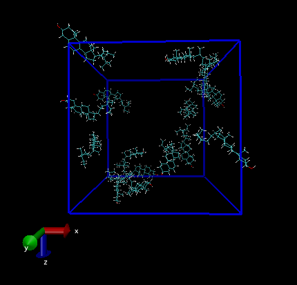
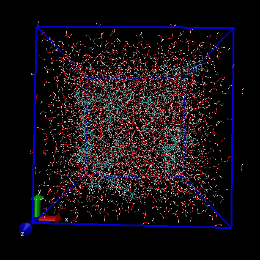
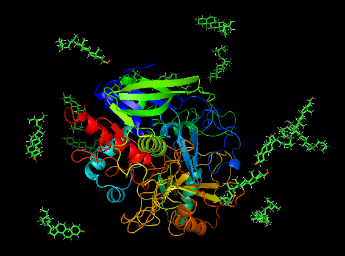

在建模的过程中，有时候我们会需要将多个配体随机地加入到体系里面。比较常听说的能做这类事情的工具包括 `PACKMOL` , `GaussView`等等。gmx里面也有一个命令能做差不多的事情，`insert-molecules`。

这个命令很简单，涉及到的参数也很少，可以通过`gmx help insert-molecules`一下子就学会这个命令。

## 建立多个随机位置配体的体系

`insert-molecules`可以从头建立一个包含多个随机位置配体的体系，命令如下：

> gmx insert-molecules -ci  lig.pdb -nmol 15  -box 4 4 4 -o system.gro 

`-ci` 参数表示要插入的分子的坐标文件，支持 .gro/.pdb/.g96等多种格式；

`-nmol`表示要插入分子的个数（摩尔数）；

`-box`设置盒子的大小。

可以看到某些分子的部分原子会超出盒子范围，可以先预先把盒子调小一点，之后再`editconf`把盒子稍微扩大。

> gmx editconf -f out.gro -bt cubic -box 5 5 5 -o box.gro 
>
> gmx solvate -cp box.gro -cs spc216.gro -o solv.gro

体系搭好之后记得编写topol.top把配体的拓扑文件加进去哦。

## 往现有体系里随机加配体

比方说有一个通过`editconf`添加了盒子之后的complex.gro文件（包含一个蛋白），现在往里面加15个配体。

> gmx insert-molecules -f complex.gro -ci lig.pdb -nmol 15 -o out.gro 

成了（可能需要按需求微调下盒子大小）。之后就可以加溶剂，编写topol.top然后愉快模拟。

## others

在这样的简单需求下，和packmol比起来，`insert-molecules`显然要更加简单。但是对于复杂布局的体系，比方说细胞膜上磷脂双分子层的排布，它就无能为力了。简单来说，往体系里加入位置随机、数量较少的配体或者小分子等，这个工具还挺好用的。

建模很累，建议定时起来走走活动活动。

祝安~