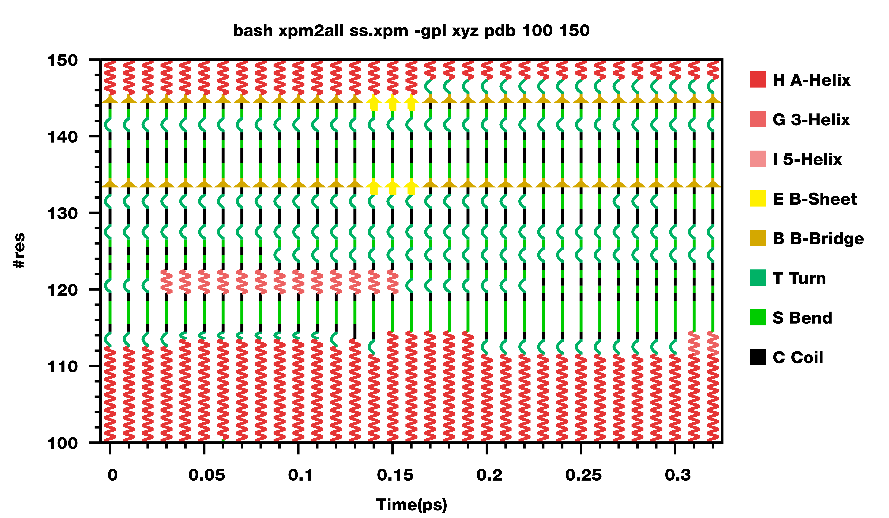
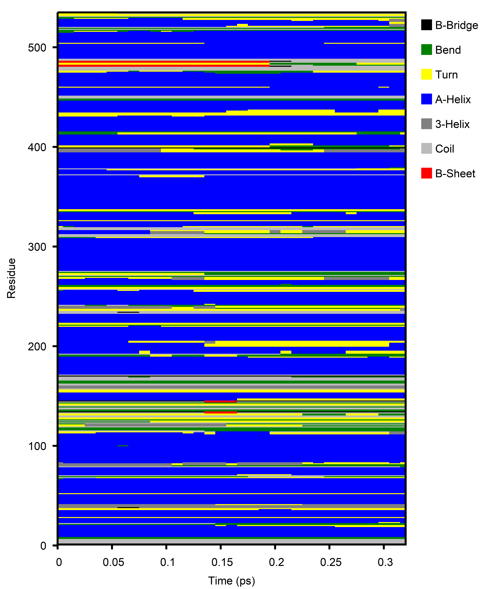

## 模拟轨迹中蛋白质二级结构变化计算--DSSP

有些情况下，蛋白质的二级结构含量变化等信息会是我们比较关注的。gmx当中自带着`do_dssp` 命令可以呈现模拟轨迹中蛋白质二级结构。

不幸的是`do_dssp`命令依赖于DSSP软件，而DSSP软件源码倒是有的，但是似乎很难找到适合win10的编译好的二进制文件。自己编译似乎也是一件麻烦不断的事情，不太愿意折腾。所幸我还有一台运行着Manjaro的台式机，可以直接AUR里面一行命令安装，相信对于其它的Linux发行版也差不多，安装不会太难。要是想要自己从源码编译，在Linux下也是一件不麻烦的事情，估摸着不会超过5行命令吧，顺利的话。

要是有大佬有windows平台下的DSSP预编译程序，欢迎分享啊！很多刚入门的同学还是比较愿意使用windows操作系统的。

安装完DSSP并且添加到环境变量使得gmx能够调用到，就可以用`do_dssp`命令来进行轨迹中蛋白质的二级结构计算了。`do_dssp`命令具体怎么用可以用`gmx help do_dssp`查看，能够用gmx的这个命令来算二级结构的人，估摸着总还是用gmx建模过的，gmx命令的帮助信息总还是看得懂的。`do_dssp`命令不仅可以提供二级结构变化的xpm文件，还可以统计每一帧的二级结构含量等信息，挺方便的。

得到xpm之后可以通过gmx的`xpm2ps`命令转换成ps文件，然后photoshop可以打开的，或者可以用IrfanView这个图片查看软件直接打开xpm文件（运气好的话可以的）。个人觉得，这两种方式得到的图都不太好看。

其实xpm文件也就是个文本文件，打开看看似乎格式也很简单，自己会写个HelloWorld的话不妨可以写两段代码解析然后绘图，可以完全根据自己需要来，就还美滋滋的，当然难度多半不会太小。

稍微折中的方案，也即Jerkwin老师在他的博文里提到的：用gnuplot来绘图，只需要把xpm文件转换成gnuplot绘图的gpl脚本就可以了。gnuplot绘图程序有windows下预编译好的二进制程序的，可以在sourceforge上下载到，Linux平台下的就不用说了。Jerkwin老师在他的github上gmxtool repo里提供了xpm2all.bsh脚本，可以将`do_dssp`命令得到的xpm文件转换成gnuplot可读的gpl文件，简单的使用举例：

> bash xpm2all.bsh ss.xpm -gpl xyz gmx

xpm2all.bsh把xpm文件转换成gpl脚本这个功能还可以设置配色，输出的形式，甚至还可以直接在图上画出简单的二级结构。第一次见到的时候真的觉得非常的惊艳！

从老师的博文中扒了一张图来和大家一起感受下(https://jerkwin.github.io/2021/03/30/xpm2all更新-二级结构绘制_颜色方案)，非常漂亮，只可惜只能适用于较小采样量的情况。除此之外，xpm2all.bsh还可以设置要绘图的氨基酸范围等，也提供了转换xpm文件配色等多种功能。

有一个小缺陷，这是个bash脚本，windows上需要依赖像cmder之类的东西才能运行。最近我刚好在做相关的一点事情，似乎发现老师最新更新的这一版脚本有点儿小问题，`-rgb`转换xpm文件配色的时候，出来的xpm文件配色那两行没了二级结构的注释，这样的xpm文件不能通过`-gpl`功能转换出可成功执行的gpl文件。期待老师修bug哈哈哈。

五一的时候我学了点儿Golang，就重写了老师这个脚本里面xpm2gpl部分的功能，当然没有fancy的那种了，只有最朴素的二级结构含量图的功能，不过倒是除了`-gpl`部分的五种配色，还加上了`-rgb`部分的20种配色，不过总的来讲，大部分的配色还是都不是特别好看。

大概出来的图像这样吧，功能没老师的多，但是好在golang很方便编译成二进制文件，故而我也编译了windows可用的exe提供给大家。可以在github上下载（https://github.com/CharlesHahn/Scripts-for-DOCK-and-MD/tree/master/sources/dssp）。

这段时间科研不是很顺，嗯，还需要多加油。说起来好像很多做生信相关的，大都一门高级语言像python、perl、R、julia（好像用得不多）的，还一门稍微底层些的，C或者C++，经典的就这俩了。就我个人的好恶而言，perl似乎已经没太多活力；R语言写的脚本简直跟bash一样是完完全全的天书，看得人想遁入空门；Julia还成，但就写脚本而言，毕竟不合算，它解释器的启动预热时间很可能比小脚本的运行时间还长，而且从语法上来讲，似乎也有点儿四不像，有类似于C的结构体，类似于Lisp的宏，类似于python的列表生成式等等，考虑到是一堆正儿八经的科学家攒出来的，倒也能理解这门语言为啥像个编程语言特性收集器了，每个人都想往里面塞自己想要的东西可能；特性太多太多，对初学者确实不友好；不过得益于它越来越多越来越精美的第三方库，以及它较快的运行速度（不考虑JIT预热），确实还是蛮有用处的，我在考虑之后或许构神经网络啥的试试用它，说不定比python快呢。python也有更快的方法，考虑到PyPy和numba之类的话，所以有初学的朋友还是建议python，有一点编程基础的话，看一晚上教程就可以上手，写上几百上千行也就大致能用了，不求精通，只求能实现自己需要的功能哈哈哈。稍微底层的语言，C可能语法简单些，能用吧，C++还是太复杂，终究还是没能学得会。Golang倒是不错，基础部分都还挺简单的，数据类型也挺丰富且不杂乱，有类似于python中list的slice，有类似于python中dict和map，还有结构体什么的，写起来也挺舒服（除了字符串取出来的是编码而不是字符这一点让我非常迷惑之外），我准备就用它作为我的底层语言了。

祝各位写出来的代码莫得bug，冲！