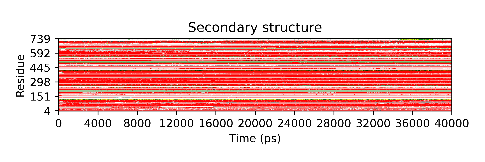
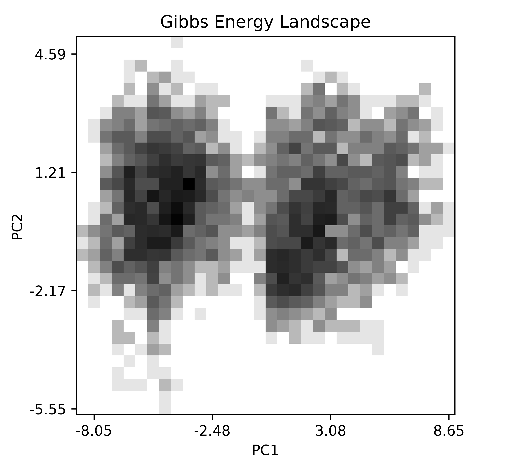
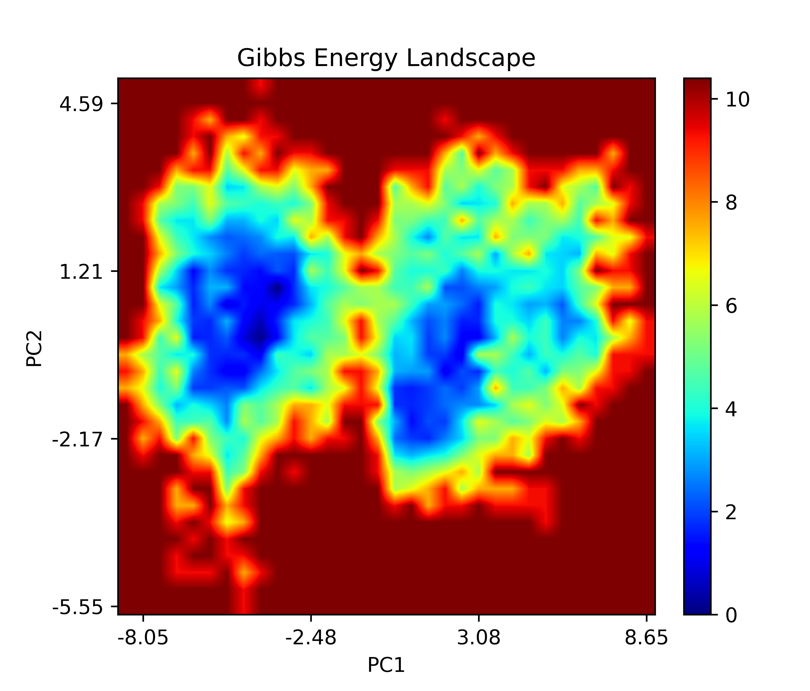

# xpm2png

## XPM文件

GROMACS的多个命令都会生成xpm文件，例如`gmx covar`，`gmx  sham`，`gmx do_dssp`等。

XPM是一种图片文件格式，文件用用各种字符记录了图片每个像素点的颜色等信息。我们可以用sublime或者记事本等文本编辑器打开XPM文件，看到的内容应该和下面的类似：

```xpm
/* XPM */
static char * XFACE[] = {
/* <Values> */
/* <width/columns> <height/rows> <colors> <chars per pixel>*/
"48 4 2 1",
/* <Colors> */
"a c #ffffff",
"b c #000000",
/* <Pixels> */
"abaabaababaaabaabababaabaabaababaabaaababaabaaab",
"abaabaababaaabaabababaabaabaababaabaaababaabaaab",
"abaabaababaaabaabababaabaabaababaabaaababaabaaab",
"abaabaababaaabaabababaabaabaababaabaaababaabaaab"
};
```

由`/* */`包裹的是注释部分。在这个示例文本的第五行有四个数字，记录的是该xpm文件中图片的宽、高、颜色的数目、每个像素点由多少个字符代表。

GROMACS生成的XPM文件比上面的示例多了很多注释部分，包括图名、图例、横纵坐标的名称、刻度值等，在字符和颜色行（如`"a c #ffffff"`）的末尾，还有特殊的注释，表明每个字符和颜色代表的含义。

```xpm
/* XPM */
/* This file can be converted to EPS by the GROMACS program xpm2ps */
/* title:   "Secondary structure" */
/* legend:  "" */
/* x-label: "Time (ps)" */
/* y-label: "Residue" */
/* type:    "Discrete" */
static char *gromacs_xpm[] = {
"33 535   7 1",
"~  c #FFFFFF " /* "Coil" */,
"E  c #FF0000 " /* "B-Sheet" */,
"B  c #000000 " /* "B-Bridge" */,
"S  c #008000 " /* "Bend" */,
"T  c #FFFF00 " /* "Turn" */,
"H  c #0000FF " /* "A-Helix" */,
"G  c #808080 " /* "3-Helix" */,
```

## XPM文件的可视化

### 常见查看方法

gmx自带了一个`xpm2ps`命令，可以将xpm文件转换为eps文件，一般来说eps文件就可以用photoshop等软件打开直接查看了。可以通过`gmx help xpm2ps`查看`xpm2ps`命令的使用方法。如果出来的图片效果不好，还可以给这个命令添加一个参数文件来控制图片的样式。如果使用的Linux操作系统，还可以通过`convert`命令将eps文件转化为png等文件格式。

xpm文件可以直接用GIMP或者irfanview等软件打开，不过可能需要删除掉xpm文件中多余的注释。

### `xpm2all.bsh` 

个人最推荐的还是李老师的`xpm2all.bsh`脚本，功能丰富，格式可控，图片效果好！

这个脚本可以将xpm文件转换为xyz三列数值的文本，方便后续作图；也可以将xpm文件转换为gnuplot可读的脚本文件(.gpl文件)，因而后续可以利用gnuplot方便地进行绘图。

https://github.com/Jerkwin/gmxtool，这是李老师的gmx工具箱，相关的脚本和教程都在这里了，感兴趣的朋友可以自行查看。笔者之前也曾写文探讨过这个脚本的使用和其生成的gnuplot脚本的修改定制（https://zhuanlan.zhihu.com/p/380242442）。

这种xpm可视化方法的两个主要好处：1. 生成的gnuplot绘图脚本可以很容易按照自己的需求进行修改；2. 其生成的图，质量真的非常高。两个主要的“缺点”：1. 依赖于bash环境（windows下可以使用cmder等工具）和gnuplot软件，2. 如果xpm文件内的像素点太多，生成的gpl文件可能非常庞大。

### `xpm2png` 

对于`do_dssp`命令生成的蛋白质二级结构变化的xpm文件，我之前也曾写过xpm2gpl程序来进行xpm文件到gpl文件的转化，功能与xpm2all.bsh脚本的一部分功能一致。因为程序是用golang写的，所以在各个平台上都能很容易地编译成可执行程序，xpm2gpl.exe程序可以在https://github.com/CharlesHahn/Scripts-for-DOCK-and-MD/tree/master/sources/dssp 找到。

联想到平时遇见xpm文件的场景不止`do_dssp`这一处，还有自由能景观图、主成分分析等。自由能景观图的xpm，之前也是使用脚本转换成xyz数据文件然后再自行绘图的，多了一个步骤并且不太方便。因而想着，或许我可以写一个简单的程序，直接将xpm转换成图片文件或者直接显示出来，因此就有了下面的程序。

$$xpm2png.py$$，一个python3的脚本，可以直接载入xpm文件然后利用matplotlib绘制出来，也可以设置直接将图片保存成png文件。

具体的使用方法如下：

```
$ xpm2png.py -h
xpm2png.py : python3 script for visualization of xpm file generated by GROMACS
        -f : [<.xpm>]      (gibbs.xpm)
               xpm file to be inputed
     -show : [yes/no]      (yes)(default)
               whether to show figure directly
        -o : [<.png>]      (output.png)   (optional)
               png file to save figure
       -ip : [yes/no]      (no) (default)
               whether apply interpolation to xpm data
               ONLY effective for xpm file of Continuous type
               interpolation would be useful for some cases, eg. FEL
        -h :   show this usage info
```

`-f`参数后面跟要显示或者转换的xpm文件名；`-show` 参数的意思是要不要直接显示图片，默认是要显示的，但是在某些服务器上，可能没有图形窗口，因而可能也就需要将这个参数设置成no；`-o`参数后面跟要将图片输出到的png文件名字，这个参数是可选的，不写这个参数的就不会保存图片；最后一个参数`-ip`的意思是要不要对xpm中的图进行插值处理，这个功能对于自由能景观图可能非常有用，对其它的xpm文件可能就不太适合，因而默认是不开启的。

对于xpm文件中的图名，横纵坐标名字和值都能较好的画在图上，但是图例就有一些问题，还挺麻烦的。不过用来即时查看xpm文件还是很可的。还有就是这个脚本是按照像素点进行xpm文件到png文件的转化的，所以图片的横纵比例也是跟xpm一样的。对于某些横纵比例相差特别大的xpm文件，出来的图就会稍微有些奇怪，特别矮长或者特别高短。

> xpm2png.py -f dssp.xpm -o dssp.png



> xpm2png.py -f gibbs.xpm -o gibbs.png



> xpm2png.py -f gibbs.xpm -o gibbs.png -ip yes



插值之后是不是好看多了~


当然，这个脚本仅仅是用来查看这些gmx生成的xpm文件的，若是要作图发文章，当然是不行的，还需要再自行作图美化美化。


除此之外，因着近日需练习Golang，也就写了go语言的版本，只不过没有插值和显示的功能了，只能把xpm文件按照像素转化成png文件，也没有图名坐轴等东西啦。我也把xpm2png.go编译成了xpm2png.exe，使用如下：

> xpm2png.exe -f dssp.xpm -o xpm2png.png


上述提到的xpm2png.py脚本，xpm2png.go和由其编译得到的xpm2png.exe都可以在我的github仓库获得，https://github.com/CharlesHahn/Scripts-for-DOCK-and-MD/tree/master/sources/xpm2png 

希望大家用用，提提意见，欢迎issue和PR。


## something else

相较于李老师的脚本，xpm2png.py是python3的，我想至少可读性上较之bash脚本要好太多。笔者愚钝，总以为bash和awk等脚本语言不是凡夫能学得会的，甚至我的编辑器都不能将bash脚本正确着色。另外，这个脚本不依赖gnuplot，因而不需要安装gnuplot了；但其需要matplotlib这个三方库，如果需要即时显示出来的话，还需要你的操作系统支持gui的窗口，部分服务器上是没有图形化界面的。因为李老师的脚本不是直接生成图像，而是生成gpl文本，故而可以通过调整gpl文本的内容很方便地控制最终成图的细节和质量；这点我还很难做到，即使是横纵坐标值的显示，也是马马虎虎不尽如人意。但权且将之当作一种快捷的xpm可视化方案，似乎也还堪用。

言及Golang，还是蛮不错的，简单的语法和python颇有类似之处，写来甚是有趣。

近期暑热，实为难耐。


