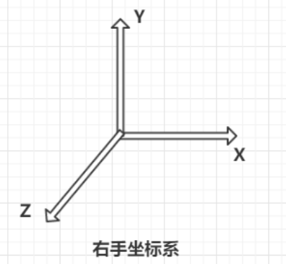
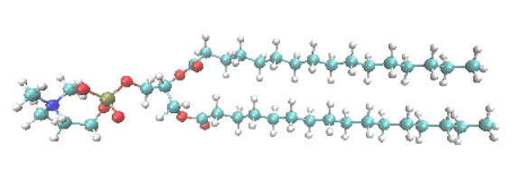
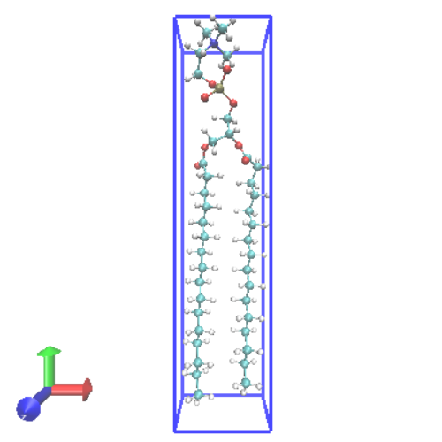
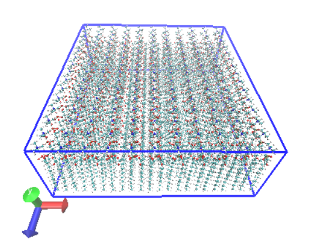
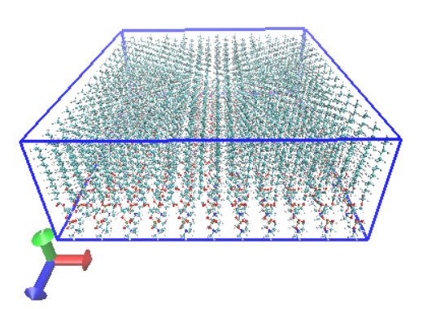
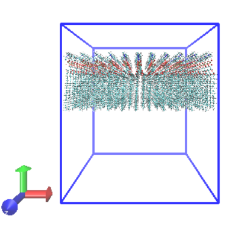
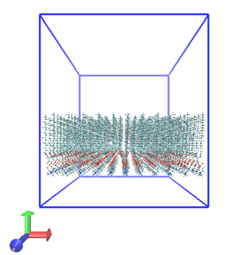
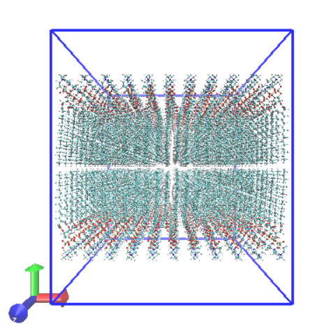
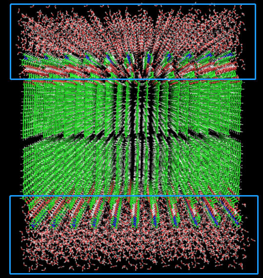

# 脂双层构建：利用gmx原生命令

## Preface

脂双层，常见的如细胞膜，囊泡等等。某些时候，我们可能需要在模拟的体系中构建这样的一个脂双层。构建脂双层的方法有很多，CHARMM-GUI、packmol、genmixmem(http://sobereva.com/245)等方法都可以用来构建脂双层。

今天主要跟大家分享如何利用gmx的原生命令`editconf`、`genconf`、`solvate`等来构建一个DPPC脂双层膜。

## gmx命令构建脂双层

下面所有的步骤都是在gromacs2019.05执行的，初始文件为一个从ATB网站上下载得到的DPPC的坐标文件（dppc.pdb）。

首先概述下所需要的步骤：

1. 确定坐标系，膜的朝向
2. 利用`editconf`将dppc.pdb转化为只含一个dppc分子的小盒子
3. 利用`genconf`将多个dppc小盒子进行平铺得到脂单层
4. 利用`editconf`旋转脂单层得到另一个脂单层
5. 利用`editconf`和`solvate`命令将两个脂单层组合成脂双层
6. 对体系进行溶剂化和预平衡
7. 检查体系是否合乎要求，否则回到第1步重新开始

#### 1. 确定坐标系和目视检查

首先要做的就是确定一下自己要建立的脂双层在坐标系中的位置。

经笔者测试，gmx使用的或许是右手坐标系，如下图：



我们要建立的脂双层呢，它的平面法向方向呢是平行于Y方向的，也即脂双层平行于XZ平面。

我们先来查看一下下载得到的dppc.pdb文件中分子的朝向。

 

可以看到，dppc的分子取向大致和X轴平行，亲水头部在左边(-X)，亲脂尾巴在右边(+X)。

还需要注意的是，在本文所阐述的整个建模过程中，dppc分子的构象都是不改变的。如果初始构象不理想，则可能构建出来的脂双层也非常不理想。在这里，我们希望dppc的两条亲脂尾巴比较并拢而不是岔开，如此经过本文阐述的建模之后，分子与分子之间则会较为紧实而不会有太多空隙。

如果你的分子构象不佳，推荐你用Avogadro做一下能量最小化，在能量最小化的过程中扒拉一下你的分子，让它达到一个合适的初始构象。如果Avogadro无法对你的分子文件做EM，我猜可能是原子名字等不合它的规矩，如果分子不复杂可以考虑直接在软件里重新画一个并优化初始构象，再重新弄力场文件。

#### 2. 构建dppc小盒子

明确了坐标系和分子取向之后，接下来我们需要将dppc分子装进一个小盒子，然后才能利用小盒子的平铺来构建脂单层。

将dppc分子装进小盒子的命令非常简单：

```bash
gmx editconf -f dppc.pdb -o dppc_box.gro -d 0.0 -rotate 0 0 -90
```

`editconf`命令的参数和说明都可以使用`gmx help editconf`命令查看。这里简单介绍下`-d 0.0` 和`-rotate 0 0 -90`的含义。

通常我们使用`editconf`建盒子呢，有两种方式：一是直接利用`-box`参数直接指定盒子尺寸等信息，二是利用`-d`参数指定盒子边缘距离分子的最小尺寸。这里使用`-d 0.0`的意思即是建立一个刚刚好容纳dppc分子的盒子，盒子边缘距离dppc最小距离为零，当然这是一个立方体盒子。指定为0.0而不是其它距离参数的含义在于尽量减少平铺之后分子之间的间隙。

`-rotate 0 0 -90`的含义呢，则是将分子以Z方向的轴对称轴顺时针旋转90度，也即把亲水头旋转到Y轴正方向的朝向上来。`-rotate`参数后面跟的三个数字，分别表示沿以X、Y、Z方向的轴对称轴旋转多少度。当然旋转是有方向的，正值表示逆时针旋转，负值表示顺时针。

如果最后构建出来的脂双层不合预期要重新来过，也就是在这些参数值的大小上下功夫了。

最后得到的dppc_box.gro显示出来就是下图的样子：



在命令执行完的回显里面，或者dppc_box.gro的最后一行，有记录这个小盒子的尺寸：0.7140  3.0696 0.5463 。

**补充修正: 根据相关文献，单个磷脂在膜中的面积约为62平方埃。本文中使用的dppc小盒子的尺寸太小了，也即本文中的堆积方式过于密集，会造成预平衡过程中体系的异常膨胀。可以通过更改dppc_box.gro的尺寸，例如将x和z改为0.8，然后再平铺堆积即可。这样平铺得到的膜更接近“自然”状态，但dppc的分子间间隙较大，需要在预平衡初期进行上下两端的水的位置限制，防止水进入膜内，一段时间的弛豫之后再放开限制平衡一会儿即可。**

#### 3. 脂单层的构建

在有了dppc的小盒子之后，我们只需要在X和Z方向上对小盒子进行平铺就可以得到一个简单的脂单层了。

```bash
gmx genconf -f dppc_box.gro -nbox 11 1 15 -o mem_up.gro
```

假设我们需要一个X和Z方向尺寸都为8 nm左右的脂双层，则根据上一小节末尾的dppc小盒子的尺寸，计算在X和Z方向上各应该平铺多少个小盒子。`-nbox`后面跟的三个参数呢，就是X、Y、Z方向上平铺的小盒子的个数。这里粗略计算了下，大致X方向上铺11个，Z方向上铺15个。

铺完之后的box_up.gro显示出来是这样子的：



看起来还是不错吧，仔细检查之后也没发现有不同分子之间的原子重合。这个脂单层盒子的尺寸是 7.854 3.0696 8.1945。

之后我们需要将之上下颠倒一下，构建脂双层下面的脂单层：

```bash 
gmx editconf -f mem_up.gro -o mem_down.gro -d 0.0 -rotate 0 0 180
```

这里是以Z方向上的法向为轴进行逆时针180度的旋转，当然你也可以以其它两个方向上的法向为轴进行旋转。




### 4. 脂双层的构建

在构建好两个脂单层之后，我们将之组合起来就好了。首先我们将两个脂单层都放进同样尺寸的大盒子的不同位置，得到两个大盒子，再用`solvate`命令将两个大盒子融合。

首先将两个脂单层放进两个同样尺寸的大盒子的不同位置：

```bash
gmx editconf -f mem_up.gro -o box_up.gro -box 7.9 9.0 8.2 -center 3.95 6.00  4.10
gmx editconf -f mem_down.gro -o box_down.gro -box 7.9 9.0 8.2 -center 3.95 3.00 4.10
```

这里确定的大盒子的尺寸是7.90 9.0 8.2；X和Z方向的尺寸只比脂单层在这两个方向上的尺寸大一点点，也即刚好能够容纳；Y方向上的尺寸这里定为9 nm，考虑到了脂单层的厚度为3.07 nm，再加上上下两端需要做溶剂化的空间。

`-center`参数在这里非常重要，意为将脂单层放置到大盒子的具体哪个位置。X和Z的参数都是大盒子的X和Z尺寸的一半；Y值的大小就有点儿讲究，上层脂单层的这个值为6.00，下层为3.00；请试想，将这两个大盒子叠合在一起，则这两个脂单层不会有重叠的地方，刚好上下错开。当然，你可以通过试错的方式不停调整这两个值，直到你满意为止。

上层脂单层的大盒子：



下层脂单层的大盒子：



之后，咱们把这两个大盒子合二为一：

```bash
gmx solvate -cp box_up.gro -cs box_down.gro -o box.gro
```

`solvate`这个命令相信大家都用过的。`-cp`是待溶剂化的分子（p指代protein），`-cs`指溶剂化的体系（s指代solvent）。这里的意思就是用box_down.gro去溶剂化box_up.gro。需要注意的是，如果溶剂化的体系与待溶剂化的体系有位置冲突，则溶剂化体系中有冲突的分子会被删掉。



做完这一步之后就得到脂双层了，看起来规规矩矩很合强迫症的喜好，但同时也可能意味着这个脂双层的熵太低了，并不“自然”，因为还需要一些弛豫的时间，来让它变得自然和可靠。


#### 5. 溶剂化和预平衡

在构建好脂双层之后，我们还需要对体系做溶剂化和预平衡，平衡几个纳秒或者几十个纳秒之后才能得到自然可靠的脂双层结构。

对上述构建的脂双层做溶剂化，需要注意的是，不能将水填充到两个脂单层中间的间隙和亲脂尾的间隙里面了，不然平衡之后两个脂单层中间就会夹着一坨水。这里也是利用之前提到的构建大盒子的手段来准确地对脂双层盒子的上下两端进行溶剂化。

首先利用gmx提供的spc216.gro构建两个水盒子：

```bash
gmx solvate -cs spc216.gro -o water_up.gro -box 7.9 2.4 8.2
gmx solvate -cs spc216.gro -o water_down.gro -box 7.9 2.4 8.2
```

如果你使用的不是SPC或者TIP3P之类的三点电荷水模型，那就换用其它的平衡好了的水模型的盒子。

然后将这两个水盒子扩展成大盒子，并放置在大盒子中相应的位置：

```bash
gmx editconf -f water_up.gro -o water_box_up.gro -box 7.9 9.0 8.2 -center 3.95 7.8 4.1
gmx editconf -f water_down.gro -o water_box_down.gro -box 7.9 9.0 8.2 -center 3.95 1.2 4.1
```

之后将两个水的大盒子合成一个大盒子：

```bash
gmx solvate -cs water_box_up.gro -cp water_box_down.gro -o water_box.gro 
```

最后利用水的大盒子对脂双层的大盒子进行溶剂化：

```bash
gmx solvate -cs water_box.gro -cp box.gro -o true_box.gro 
```

最后得到的体系：



脂双层的上下两端被填充了水，不错吧！

根据命令的回显输出，我们一共往体系里溶剂化了6532个水分子。

心细的同学可能发现，前文使用的两个水盒子的厚度各是2.4 nm，而脂双层的厚度总和在6.1 nm左右，加起来10.9 nm了啊，远超过咱定义的盒子Y方向尺寸 9 nm ？！其实我们想要的，只是亲脂尾的部分，也即脂双层的内部部分不要有水分子，至于亲水头，我们还是希望其能够被淹没在水分子中的。请注意观察上图的蓝色部分，我们可以看到，脂双层的亲水头部分的堆积并不如亲脂尾部分那样致密，在亲水头和亲水头中间还有凹槽和空隙，这部分我们还是希望其能够被淹没的，故而水盒子的厚度稍微厚一些，这样可以把这部分也充分溶剂化。不用担心位置冲突，与亲水头有位置冲突的水分子会被自动删掉的。当然，你也可以不对亲水头部分进行溶剂化，反正不管怎么弄，之后都要在NPT下进行弛豫。一段时间的控压控温弛豫之后，体系会自动平衡到合适的“自然”状态的。

预平衡之前还有个步骤，写体系的拓扑文件，也即topol.top。dppc的拓扑当然也是从ATB上扒拉的，水的拓扑本来就有，按照相应的规则include进去，然后写下体系中有多少dppc和水，差不多就可以了。下面展示的是本次体系的topol.top，39XN是dppc的名字。

```topol.top
; Include forcefield parameters
#include "gromos54a7_atb.ff/forcefield.itp"

; Include dppc topology
#include "dppc_atb.itp"

; Include water topology
#include "gromos54a7_atb.ff/spc.itp"

[ system ]
; Name
mem in water

[ molecules ]
; Compound        #mols
39XN              330
SOL               6532
```

预平衡的部分我就不用赘述了，同样的EM、NPT的模拟步骤。一致模拟到体系的温度、压力、密度、盒子尺寸等都稳定之后，差不多就可以了，目视检查下没问题，就可以把脂双层结构抽取出来用作真正的模拟的用途了。

需要注意，如果NPT的时候结构总是崩坏，可以考虑逐渐升温到300 K而不是一下子上来就`genspeed 300`；另外，如果平衡过程中水总是跑到膜里面，也可以考虑给水加个限制势，等膜弛豫好啦在解除限制平衡一段时间。

## Something else

还想在膜内插入一点儿东西？一个长链儿分子或者一个蛋白？可以考虑使用pymol来完成这项工作：手动删除某些dppc分子留出想要的空隙，并将要插入的长链儿分子或蛋白摆放到合适的相对位置即可。当然，这听起来也太”艺术“了，还可以用`solvate`命令来构建这样的一个体系，用构好的膜作为"溶剂"去溶剂化长链儿分子或者蛋白，当然你得先把长链儿分子或者蛋白的位置确定好；溶剂化的过程中，gmx会自动删除与长链儿分子或者蛋白位置重叠的dppc分子。这两种方法做出来的体系，在膜与长链儿分子或者蛋白之间，或多或少都有多余的空隙，也就是需要之后多弛豫一会子了。

前文介绍的脂双层的构建方法，得到的脂双层往往是低熵的，分子与分子间的间隙可能也比较大，也是需要稍长一些的弛豫时间来让它达到“自然”的状态的。总的来说这种方法还是稍显粗糙，不过玩玩体验一下也还挺可。

虽已立秋，仍旧闷热难当。


