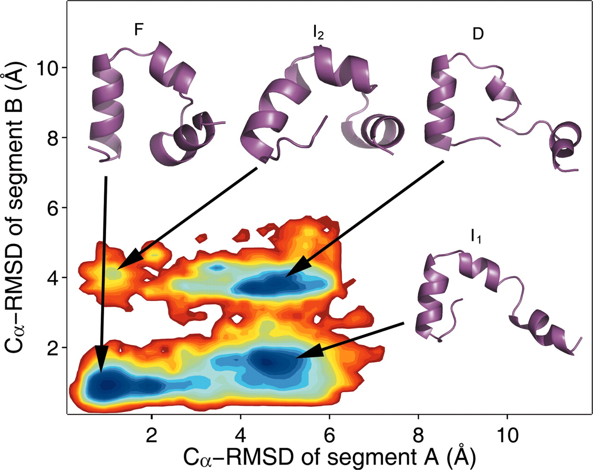
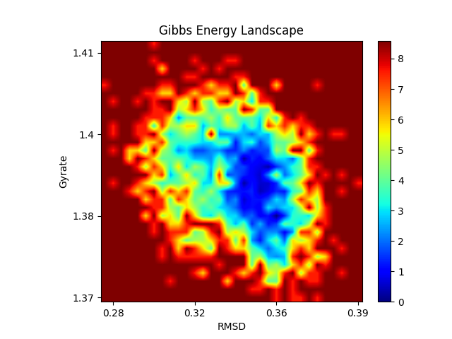
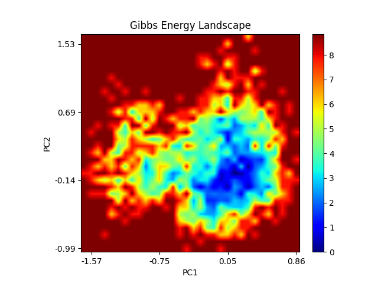
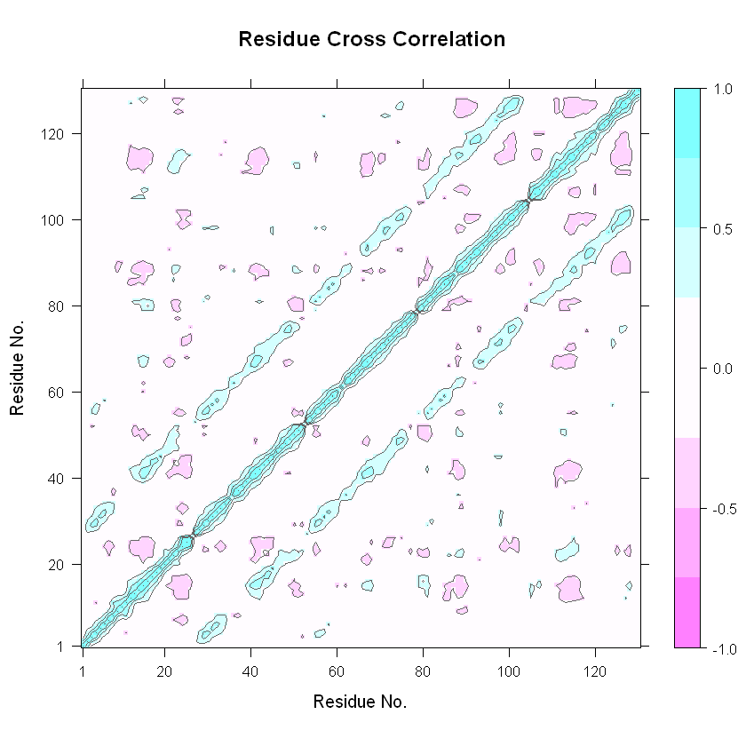
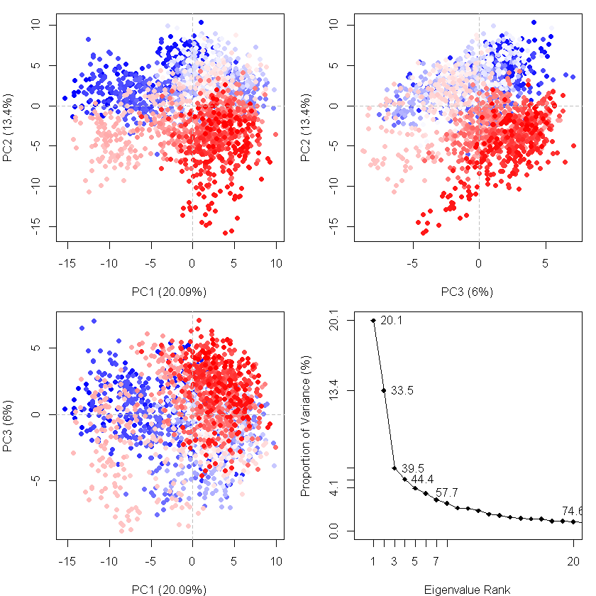

# PCA/FEL

## 0. 自由能形貌图

自由能形貌图，就是用一张图来表示分子的构象自由能的变化。

比如文献中常见的这类图（下图出自 https://doi.org/10.1073/pnas.0608432104）：



图上不同的能量洼地表示不同的低能量构象。

这种自由能景观图表征的是构象的相对自由能而非绝对自由能。一般可以通过两个描述体系特征的量来进行绘制，如这里的两个片段的RMSD。文献中的自由能形貌图通常利用RMSD和gyrate，或者体系运动的前两个主成分PC1和PC2来进行绘制。

所谓主成分，是通过主成分分析（PCA，一种降维手段）得到的。比如说N个原子的蛋白，其运动轨迹在普通分子动力学模拟中是通过3N维笛卡尔坐标来描述的，这样高维的数据很难分析和理解。通过PCA，可以从高维数据中分析出主要的影响因素（称为本征向量）。前几个本征向量一般可以描述分子运动的大部分信息，也被称作主成分。

关于自由能形貌图FEL和主成分分析PCA可以参考如下的链接：

1. sob老师关于自由能面图的文章：( http://sobereva.com/73 )
2. jerkwin老师关于自由能形貌图绘制的文章：( https://jerkwin.github.io/2017/12/14/计算蛋白自由能形貌图的简单示例/ )
3. 以及：( http://kangsgo.com/49.html )


下文主要概述：

- 如何利用GROMACS自带的 `covar` 、`anaeig`、`sham`命令绘制自由能形貌图
- 如何利用R语言库Bio3D进行轨迹的主成分分析

## 利用gmx绘制FEL 

下文绘制FEL的轨迹来自于某一蛋白（某五聚体）模拟的后20ns，也即使用的是模拟稳定之后的状态下的蛋白轨迹。其文件为pro20.xtc，对应的参数文件为pro.tpr。使用的gmx为2019.3版本。

在最开始，请先对轨迹进行周期性校正，并消除平动和转动的影响(-fit rot+trans)：

```bash
# 1. 自行校正周期性
# 2. 用下行的命令去除蛋白的平动和转动
gmx trjconv -s pro.tpr -f pro20.xtc -o pro20.xtc -fit rot+trans
```


#### 利用RMSD和Gyrate绘制FEL

首先获得蛋白质backbone的RMSD和回旋半径数据并存储到rmsd.xvg和gyrate.xvg中：

```bash
gmx rms -s pro.tpr -f pro20.xtc -o rmsd.xvg
# 选择backbone进行计算和输出
gmx gyrate -s pro.tpr -f pro20.xtc -o gyrate.xvg
# 同样选择backbone
```

所得rmsd.xvg和gyrate.xvg还需要进行处理，删除所有注释行（以`#`或者`@`开头的行以及空行），gyrate文件中还包含XYZ三个方向上的回旋半径数据，也需要全部删去（可以用包含块编辑功能的编辑器进行删除）。

如此，rmsd.xvg文件和gyrate.xvg文件中都只有两列数据了，第一列是时间，第二列是rmsd或者gyrate数据。然后我们需要将这两个文件进行组合。把同一时间下的rmsd和gyrate数据写在同一行，也即组合文件中包含三列：时间、rmsd、gyrate数据。这一步可以通过支持块编辑的编辑器进行，也可以用脚本执行。

```bash 
pc_combine.py rmsd.xvg gyrate.xvg output.xvg
```

这里的`pc_combine.py`是笔者写的小脚本，专门做此类数据的组合，读入前两个参数指向的文件，将结果输出到第三个参数指向的文件。脚本获取方式见文末。

得到组合文件之后，我们就可以利用gmx的`sham`命令来生成自由能形貌图了。`sham`是一个挺复杂的命令，可以接受很多输入和输出，建议详细阅读`gmx help sham`给出的帮助信息。

对于本示例，我们使用如下命令来生成自由能形貌图：

```bash
gmx sham -tsham 310 -nlevels 100 -f output.xvg -ls gibbs.xpm -g gibbs.log -lsh enthalpy.xpm -lss entropy.xpm
```

简单介绍下这些参数：

- `-tsham` ： 设定温度
- `-nlevels`： 设定FEL的层次数量
- `-f` : 读入组合文件
- `-ls` : 输出自由能形貌图（Gibbs自由能）
- `-g` ：输出log文件
- `-lsh` : 焓的形貌图
- `-lss` : 熵的形貌图

在上面的命令执行完成之后，会输出好几个文件，除了上文提到的，还包括一个index文件(bindex.ndx) 和一个ener.xvg文件。

我们最关心的是Gibbs自由能的形貌图，也即gibbs.xpm。xpm文件可以通过多种方式查看，这里我使用自己编写的xpm2png.py进行查看（获取方式见文末）。

```bash
xpm2png.py -ip yes -f gibbs.xpm
```



看起来稍有些破碎的感觉，能量阱差不多可以算是1个。模拟轨迹越长，采样越丰富，画出来的自由能形貌图可能越清晰好看。

焓和熵的形貌图也可以同样的方式进行可视化，这里不再赘述。

考虑到部分同学需要获取形貌图低点处的蛋白质构象来进行分析，这里介绍下gibbs.log，bindex.ndx的作用。gibbs.log中记录了索引与能量的关系，bindex.ndx则记录了索引与帧数的关系。如下所示：

gibbs.log部分截取如下：

```log
Minimum 0 at index 26 energy      7.589
Minimum 1 at index 46 energy      7.589
Minimum 2 at index 50 energy      7.589
Minimum 3 at index 56 energy      7.589
Minimum 4 at index 141 energy      5.803
```

bindex.ndx部分截取如下：

```log
[ 26 ] # 这是索引
1274   # 这是索引对应的时间帧
[ 46 ]
2
[ 141 ]
4
1282
```

那么我们如何找最低能量的构象呢？假如说Minimum 4 是能量最低点，它的索引是141，那么我们就到bindex.ndx中找到索引`[ 141 ]`，查看到这个索引对应的时间帧是第4帧和第1282帧，然后我们利用`trjconv`命令把对应的帧抽提出来，就可以得到蛋白质能量最低构象的pdb文件了。


#### 利用主成分绘制FEL

利用主成分绘制FEL，一般来说，也就是用主成分1和2取代上文的rmsd和gyrate，后面的处理就都是一样的。

要获得主成分，需要对轨迹进行主成分分析，gmx提供了`covar`命令和`anaeig`命令帮助我们进行相关分析。请一定注意要在PCA之前消除轨迹的平动和转动，以免分子的整体运动影响分子内部运动的分析。

`covar`命令的作用是对轨迹进行协方差矩阵和本征向量的计算。

```bash
gmx covar -s pro.tpr -f pro20.xtc -o eigenvalues.xvg -v eigenvectors.trr -xpma covapic.xpm 
```

- eigenvalues.xvg里面记录了分析得出的多个本征值的序号和大小
- eigenvectors.trr即是投影到本征向量之后的轨迹
- covapic.xpm即是轨迹的协方差矩阵

命令执行之后会让你选用哪些原子做align，选`C-alpha`或者`backbone`，之后会让你选对哪些原子做PCA，也选`C-alpha`或者`backbone`，可以两次选的不一样，按自己需求来就行。当然你也可以选择其它的索引组来进行align和PCA，这里这样子轩只是因为这俩原子数稍微少一些，分析会快一些，对于结果来说，通常从FEL上看不出差别。

eigenvalues.xvg里面存储的按本征值大小排序的多个本征值。对于FEL来说，我们通常希望前两个本征值的大小的和可以越大越好，这意味着前两个主成分就可以代表蛋白的大部分运动信息。

covapic.xpm存储的是协方差矩阵，同样是xpm文件，可以用xpm2png.py查看。（由于此部分内容下一小节也有涉及，故而这里略过）

之后我们需要利用`anaeig`命令将轨迹投影到前两个主成分上，也即生成pc1.xvg和pc2.xvg，这俩xvg在之后绘制FEL中的作用就同于前面rmsd.xvg和gyrate.xvg。

```bash
gmx anaeig -s pro.tpr -f pro20.xtc -v eigenvectors.trr -first 1 -last 1 -proj pc1.xvg  
gmx anaeig -s pro.tpr -f pro20.xtc -v eigenvectors.trr -first 2 -last 2 -proj pc2.xvg  
```

之后是组合两个主成分，然后利用`sham`命令生成自由能形貌图：

```bash
pc_combine.py pc1.xvg pc2.xvg pc12_sham.xvg
gmx sham -tsham 310 -nlevels 100 -f pc12_sham.xvg -ls pc12_gibbs.xpm -g pc_12.log -lsh pc12_enthalpy.xpm -lss pc12_entropy.xpm
```

生成的pc12_gibbs.xpm可视化之后如下：



我们发现，通过前两个主成分做出来的FEL和通过RMSD、Gyrate做出来的FEL并不一样。是的，因为它们代表了蛋白不同尺度（或者方向）上的运动，对于蛋白的表示不同，得到的FEL也会不同。文献当中，这两种FEL的绘制方式都很常见。


## 利用Bio3D做轨迹的PCA

上文介绍了FEL的绘制方法，下文介绍如何通过R语言包Bio3D进行模拟轨迹的PCA分析。

R语言的解释器如何安装、Bio3D包如何安装这里不再赘述。

以下资料和教程可供读者参考：

- http://thegrantlab.org/bio3d_v2/tutorials
- http://thegrantlab.org/bio3d_v2/tutorials/trajectory-analysis

其中第二个链接给出了利用Bio3D进行模拟轨迹的详细说明，值得细细阅读。

下面就利用Bio3D进行轨迹的PCA分析。

首先要做的是将gmx产生的xtc轨迹文件转换成dcd格式的轨迹文件，Bio3D只支持dcd轨迹文件。这一步可以利用vmd进行，利用vmd载入新分子，选择xtc轨迹文件，然后将轨迹另存为dcd文件即可。

除了dcd文件之外，还需要一个包含蛋白构象的pdb文件，可以利用`tjrconv`命令从xtc文件中抽提一帧出来即可。

下面就是需要执行的R语言代码了：

```R
# 载入bio3d包
library("bio3d")
# 载入轨迹和pdb文件
dcd <- read.dcd("pro.dcd")
pdb <- read.pdb("pro.pdb")
# 选取C-alpha原子进行分析
ca.inds <- atom.select(pdb, elety="CA")
xyz <- fit.xyz(fixed=pdb$xyz, mobile=dcd, fixed.inds=ca.inds$xyz,mobile.inds=ca.inds$xyz)
dim(xyz) == dim(dcd)
# 绘制协方差矩阵
cij <- dccm(xyz[,ca.inds$xyz])
plot(cij)
# 绘制主成分图
pc <- pca.xyz(xyz[,ca.inds$xyz])
plot(pc, col=bwr.colors(nrow(xyz)))
```

绘制得到的协方差矩阵如图：



图上蓝色部分表示协同作用，红色表示相对运动。两个轴都是氨基酸序列标号。这样的协方差矩阵图，对于分析氨基酸之间的相互运动趋势非常有用。例如分析酶底物口袋的开合等情况。因为示例用的蛋白是个五聚体，所以协方差图上也能明显的看到对角线的蓝色部分大致可以分成5部分。

主成分的图如下：



可以看到前三个主成分相互之间的散点分布图，前三个组分一共才只能描述体系39.5%的运动，也即分子内的运动都比较细碎，没有类似于蛋白质折叠或者构象转变之类的大的运动。

背靠R语言历史悠久的社区和文化，Bio3D做出的图都还挺漂亮的。当然，仅仅只是做轨迹处理，没必要需要写R语言，看看教程扒拉一下示例代码，就很足够了。


## Something else

文中涉及到的 xpm2png.py， pc_combine.py 以及其它更多模拟分析相关的小脚本都可以在我的github仓库获得：https://github.com/CharlesHahn/Scripts-for-DOCK-and-MD/tree/master/sources


祝各位好~


