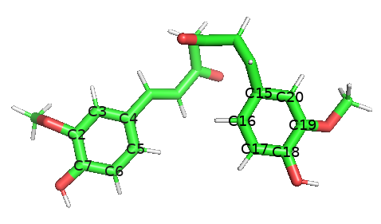
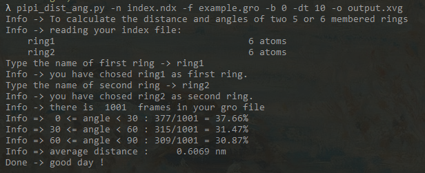
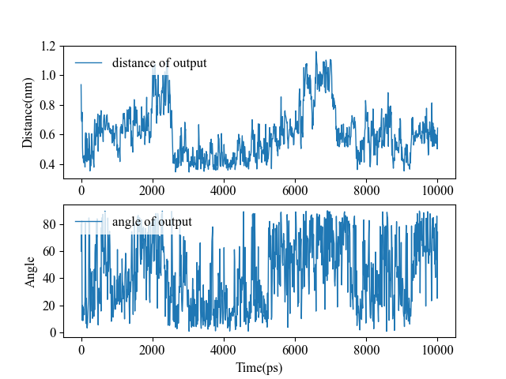

## 计算苯环之间的距离和夹角

这两天遇到这么个需求：需要计算两个苯环之间的距离和夹角，用来表征苯环的堆叠情况。

GMX的`distance`命令倒是能够计算距离，但是对于苯环的平面夹角似乎就无能为力（如果可以，烦请告知，不胜感激）。

于是写了个脚本`pipi_dist_ang.py`来做这个事情。这个脚本能计算包含5、6或者7个原子的**平面环**之间的几何中心距离和环平面的夹角。


#### Usage

```bash
$ python3 pipi_dist_ang.py -h
Info -> To calculate the distance and angles of two 5 or 6 membered rings
usage: pipi_dist_ang.py [-h] [-n N] [-f F] [-b B] [-dt DT] [-o O]

optional arguments:
  -h, --help  show this help message and exit
  -n N        index file which contains two groups of rings
  -f F        gro file
  -b B        set the start time, default=0
  -dt DT      set the time interval, default=1
  -o O        the results data, default output.xvg
```

```bash
$ python3 pipi_dist_ang.py -n index.ndx -f example.gro -b 0 -dt 10 -o output.xvg
```

上述就是这个脚本的使用方法了。有几个参数：

- `-n` : 索引文件，需要包含两个环的索引组，每个索引组里写明这个环包含的原子的序号
- `-f`：gro坐标文件，用于获取坐标和计算
- `-b`：输入gro文件的起始时间
- `-dt`: 输入gro文件对应的时间步长
- `-o`: 输出文件，可选，默认是output.xvg

gmx是直接从轨迹文件中读取坐标。但是解析二进制文件挺烦的，于是我选用了gro这种结构比较清晰的坐标文件。因为gro文件并不一定都包含时间值，故而我无法通过脚本获得正确的每一帧对应的模拟时间，因而脚本中的time其实就是帧数，需要自己设置一下gro文件的起始时间和步长，使得输出的时间序列对应上模拟轨迹的时间序列。 `-b 0 -dt 10` 就意味着这里提供的gro文件是从0 ps开始的，步长为10 ps。 这样也有一个好处，可以很方便对时间序列进行控制，比如我可以设置`-b 0 -dt 0.01`，这样就把时间的单位从ps变成了ns。


#### example

步骤一共三步：

1. 对轨迹进行周期性校正，保证分子完整、无跨盒子等，然后生成相应的gro文件（可以只包含两个分子或者只包含你需要的这两个苯环，这样文件体积比较小）
2. 在索引文件中添加这两个环的索引组
3. 应用这个脚本，并对结果进行分析


这里我用来做示例的gro文件是一个包含1001帧模拟轨迹的姜黄素单个分子的模拟轨迹，总长10 ns。

用PyMol等分子可视化的软件，查看要计算的两个环的原子的名称，如下图：



然后对照gro文件，根据环上原子的名称，在索引文件中写上相应的原子序号。例如这里的C3对应于33，C19对应于6. 

写好的索引部分如下：

```ndx
[ ring1 ]
35 33 32 46 44 41
[ ring2 ]
14 12 10 7 6 15 
```

然后就可以执行脚本了。脚本会读取你给出的ndx文件，并要求你输入你要计算的两个环的索引组的名字，如下图。这里我们输入 ring1 和 ring2。



结束之后，会在当前目录下生成一个结果文件，可以很方便的通过excel、origin或者`xvg_compare.py`脚本进行可视化。

另外还有一小部分的统计信息直接在屏幕上输出来：两个环的几何中心的平均距离，以及夹角成不同角度范围的时间占比。 




#### Important

这个脚本只能用于计算**平面环**的**几何中心距离**和**平面法向夹角**。且环只能包含5、6或者7个原子。

环平面的法向的计算是通过索引组中的第1，3，5号原子进行的，并不是所有原子。通过这三个原子，构建了两个向量，然后通过两个向量的积算的法向。因而，索引组中的原子序号的顺序，会轻微影响角度计算的结果。也即，如果你换个顺序，可能出来的角度在某些位置会有几度的误差，但大趋势是一致的。这不是我脚本的问题，而是gro文件坐标精度的问题。gro文件的坐标只精确到小数点后三位，因为精度问题，本该共面的苯环六个原子其实有轻微的不共面，因而算出来角度有小误差。

本脚本可以在我的github repo中找到：https://github.com/CharlesHahn/DuIvy/tree/master/sources/pipi_dist_ang


#### Other

最初的设想，是能做到尽可能使用方式和gmx的命令差不多，最好是：

```bash
pipi_dist_ang.py -s md.tpr -f md.xtc -n index.ndx -o output.xvg
```

我还想就让代码自己搜索轨迹中的苯环，然后直接一个个列出来，咱直接选就好了，不要自己去写ndx索引。

很显然目前还差很远，tpr和xtc似乎都不好解析，苯环搜索也挺难搞的。

之后再慢慢改进吧！

我还想写一个go语言或者C语言的版本来着，目前还没开始，等下一次有空闲的时候练手吧。

很多时候感觉，简单的编程能力还是很有需要的。我在想要不要出一系列编程入门的教程，就针对比如说模拟的分析、作图等等。可以python、C、golang、julia等几种语言实现同一个功能，互相对比，想想还挺有趣。不知道诸位感不感兴趣？欢迎留言探讨自己喜欢的语言和想学的语言。