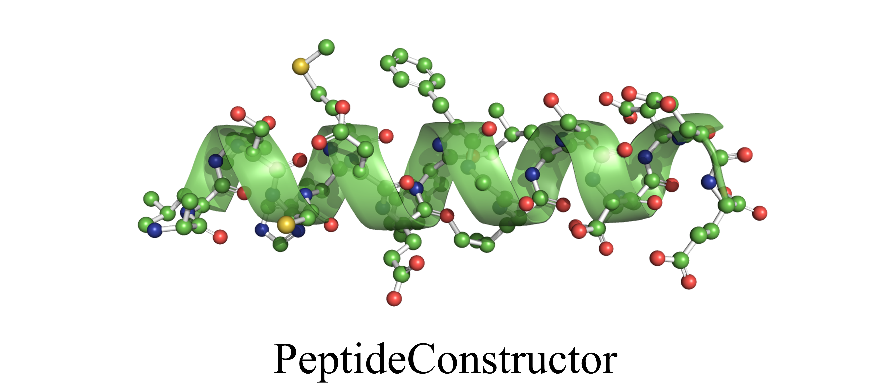
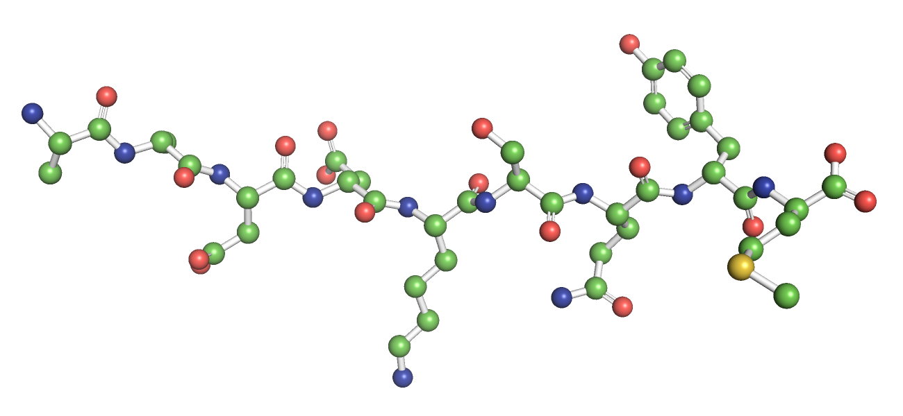

# PeptideConstructor : 一个简单的多肽建模库



## Intro

前儿预告的多肽建模工具,我做完啦!

PeptideConstructor ! 

这个工具是基于 Lun4m/PeptideBuilder.git 和 clauswilke/PeptideBuilder.git 改进而来。13年发表文章的PeptideBuilder现由clauswilke维护，可以进行天然多肽的从序列到3D结构的建模；Lun4m在其基础上增加了多肽两端的`ACE`和`NME`封端。

而我做的改进主要如下： 

1. 增加了**D型氨基酸**的支持。现在可以进行天然多肽、D型多肽、DL混合型的多肽的从序列到3D结构的建模。
2. 可以直接指定二级结构。不再需要逐个氨基酸地指定关键拓扑角度。
3. 提供了更加简单的函数接口，可以一个函数从序列到结构。
4. 提供了命令行程序**PCcli**

由于后面还想加挺多功能，（且私以为我的代码风格配不上他们原来非常pythonic的代码），就不提PR了，直接新起炉灶。为了避免和他们的库冲突，故而也换了个名字。

## Installation

你可以直接用`pip`安装：

```bash
pip install PeptideConstructor
```

或者从仓库（https://github.com/CharlesHahn/PeptideConstructor ）的`dist/`目录下载wheel文件，然后用如下命令安装：

```bash
pip install PeptideConstructor-0.2.0-py3-none-any.whl
```

或者你可以直接clone整个仓库然后：

```bash
python setup.py build
python setup.py install
```

`PeptideConstructor` 主要有两个依赖库：

- `Biopython` 用于输出PDB文件
- `Numpy` 用于坐标计算

## Usage

在安装之后，`PCcli`命令应该就可以直接在终端里执行了（`PCcli`可执行程序默认被放置在你的python的scripts文件夹下）。

`PCcli` 用一种很简单的方式从序列产生3D结构文件。

比如：

```
PCcli -s AaDdKSQym -o test.pdb
```
上述的命令会在当前目录产生一个 test.pdb，包含了序列为**AaDdKSQym**的线状多肽。在序列参数中，**大写代表天然氨基酸（L型），小写代表D型氨基酸）**。



当然，我们也可以指定整个多肽序列的二级结构和封端。（简单解释下封端，实验上合成多肽需要在两端加封端基团，以屏蔽两端不必要的肽键形成）

```
PCcli -s AaDdKSQym -o test.pdb -ss a -cap 1
```

参数介绍 : 

- `-s` : 指定序列，大写L型，小写D型
- `-o` : 输出文件的名字
- `-ss` : （可选） 指定二级结构：
  - `l` 为不指定，也就是线状多肽 （默认）；
  - `a` 为 alpha helix ；
  - `b` 为 beta sheet ;
  - `la` 为左手螺旋（就是alpha helix的镜像）；
  - `lb` 为beta sheet的镜像；
- `-cap` : （可选）指定封端：
  -  `0` 为没有封端（默认）
  -  `1` 为两端都封端，N端加 *ACE*，C端加 *NME*；
  -  `2` 只在N端加 *ACE*；
  -  `3` 只在C端加 *NME* ；


一些用例：

当然除了命令行，你也可以通过写代码调用这个库来产生多肽。

查看github仓库的examples文件夹，获取更多使用例子；原始的PeptideBuilder的接口我也都留着，可以调用。


## Post-processing

这个工具还不太完美，尤其是当你对某些氨基酸指定了某一种二级结构（尤其是对**脯氨酸**指定螺旋）的时候，可能会导致某些原子坐标过近（坐标倒是没问题，就是类似pymol的软件无法正确判定它的成键；如果你应用力场做模拟，因为涉及到EM，我想应该是ok的）。本来我想了很多办法去规避和优化，却导致代码越来越臭越来越长，索性砍了；不过这种不恰当的结果，倒也是提醒我们：**脯氨酸它就不应该出现在螺旋里！**。（不过，如果你确实需要，这个工具也能完成，就是后续处理可能要稍微关注下这里，用力场弛豫一下就好！）

这个工具产生的多肽是没有氢原子的，故而也需要自己加氢（可以pymol，**reduce**等工具）。

要是加氢正确、原子坐标位置合适的话，可以通过Avogadro的EM功能或者pymol的sculpt功能弛豫也挺好的。

个人觉得最稳妥的后处理方式还是要通过加力场去优化。（要注意力场是否兼容D型氨基酸）


我后面一大段儿都是介绍通过**reduce**和**TINKER/minimize**程序进行加氢和弛豫。太长了可能没必要看！

相关的教程：https://www.cup.uni-muenchen.de/oc/zipse/teaching/computational-chemistry-1/topics/force-field-calculation-with-tinker/

Tinker的仓库：https://github.com/TinkerTools/tinker。

简单介绍下利用Tinker进行minimize的过程：

1. 首先去tinker repo的页面下面，找到程序下载界面，进去下载对应系统的程序；同时，下载一下repo里面的params文件夹，里面有力场参数文件（或者你可以只下载你需要的力场）。都弄好之后你会得到一堆几兆大小的可执行程序（win10），以及一个参数文件夹。我们需要用到的程序有`pdbxyz`、`xyzpdb`、`minimize`，以及一个参数文件（我选的amber14sb.prm）
2. 通过PeptideConstructor产生一段DL混合构型的多肽，test.pdb
3. 通过`reduce`进行加氢，得到testH.pdb；因为reduce能够正确对alpha-C加氢，手性不会错；而`minimize`程序虽也能加氢，但不能判别CA的手性
4. 把testH.pdb放到那一堆程序的同一文件夹下（或者你可以把这一堆程序加到环境变量），执行`pdbxyz`把pdb文件变成xyz文件。命令如下：

```bash
# 第一个参数指定要转换的pdb文件，第二个参数指向力场文件
pdbxyz testH.pdb amber14sb.prm
```

5. 第4步执行完后，会生成testH.xyz和testH.seq，seq文件里面记录了序列信息。（如果你的序列里某些氨基酸有多种质子化状态，这时候可以编辑seq文件里边氨基酸的名字，来定义不同pH下的氨基酸；详情你运行一下这一堆程序里面的`protein`就知道了）。
6. 执行`minimize`对testH.xyz进行弛豫，命令如下：

```
# 三个参数：输入文件，力场参数，RMS值
minimize testH.xyz amber14sb.prm 1
```

7. 如果你想弛豫的好，RMS值可以选小一些，我这里不想改变指定的二级结构，故而就选1。弛豫好之后会得到testH.xyz_2文件，最后再用`xyzpdb`程序把它转回到pdb格式就好啦。

```
xyzpdb testH.xyz_2 amber14sb.prm 
mv testH.pdb_2 results.pdb
```

8. 目视检查下还有没有不合理的结构，有没有手性的改变。


上述用到的四个程序和参数文件，我都打包了（win10环境），如有需要浏览器输入以下链接下载：http://charles8hahn.pythonanywhere.com/download/EMofPep.zip。这些程序也都是可以交互运行的，你可以直接敲程序名回车然后进去它会提示你应该输入什么参数。


当然！大多数情况下，PeptideConstructor生成的结构都是直接可用的。


## Moving on:

- [x] add D amino acids support
- [x] add command-line interface support
- [ ] add support of more amino acids
- [ ] add support of adding amino acids to existing protein
- [ ] add energy minimization or conformation optimization support
- [ ] further more, add DNA/RNA support, I guess 


## Others

This repo is based on [Lun4m/PeptideBuilder.git](https://github.com/Lun4m/PeptideBuilder) and [clauswilke/PeptideBuilder.git](https://github.com/clauswilke/PeptideBuilder). Cite the original paper.

**Reference:**
M. Z. Tien, D. K. Sydykova, A. G. Meyer, C. O. Wilke (2013). PeptideBuilder:
A simple Python library to generate model peptides. PeerJ 1:e80.


## Others 2

最近了解到其实很多工具都是可以构建多肽的，我指很成熟的工具。比如：

**Avogadro** : 也支持D型氨基酸，预置了多种二级结构（也能自定义phi和psi），图形化界面，还自带EM功能，简直不要太香！

**PyMol** : 支持两种二级结构，图形化界面，有Sculpt功能；虽说没有D型氨基酸，但是如果只是短肽的话，你可以尝试用Invert功能来实现D型氨基酸。

其它还有很多我没接触过的、商用的、开源或者不开源的。

所以有时候我也迷糊，为啥就想要捯饬这个东西？

或许通过代码来生成多肽可以高通量？在这点上，GUI的优势也正是它的劣势（当然，你也可以通过PyAutoGUI之类的库实现在现有软件如Avogadro上高通量地生成多肽）。

或许它的代码足够简洁？足够pythonic？也有可能，毕竟我还是度过了快乐的一两天；如果需要学python，也非常推荐去看看PeptideBuilder的源码；说起可能较为广为人知的pythonic代码，或许是requests等，但太长太复杂，新手读起来可能会很累。


**虽然没必要，但有时候也可以搞搞艺术**


祝各位安~