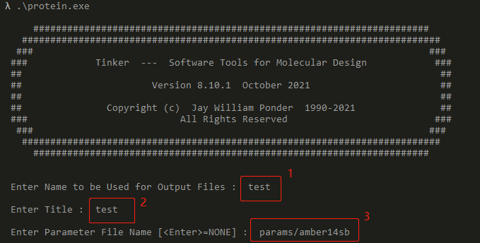
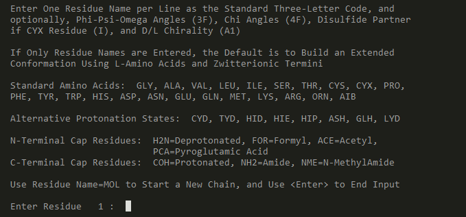
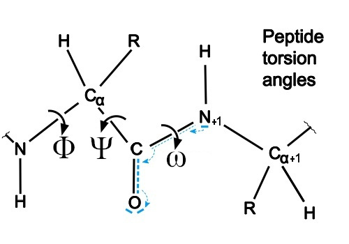
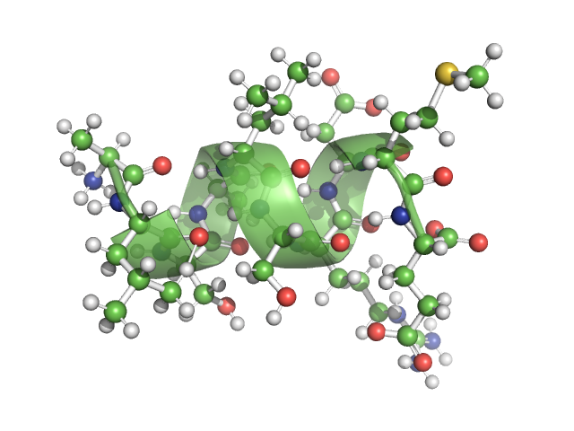
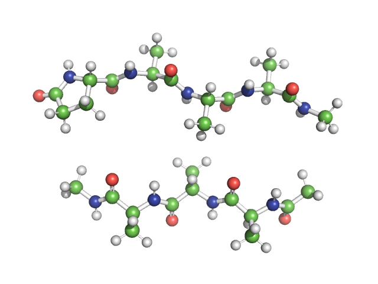
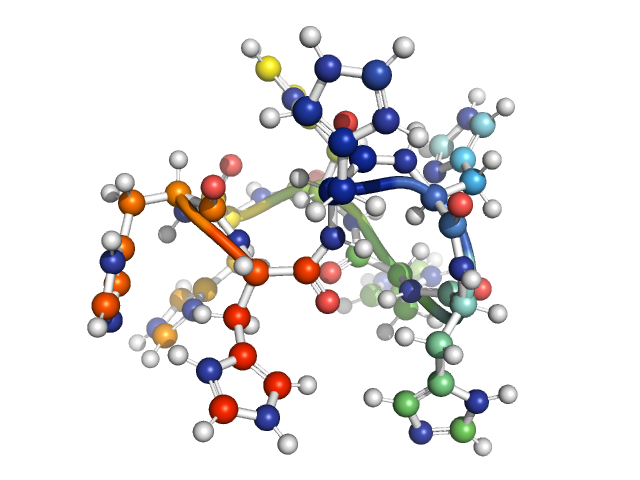
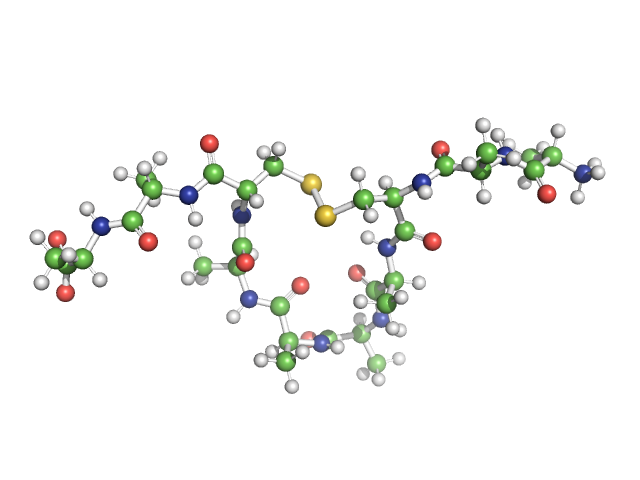
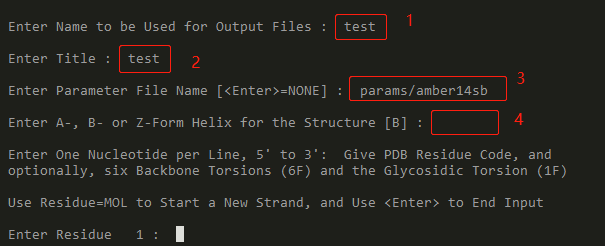
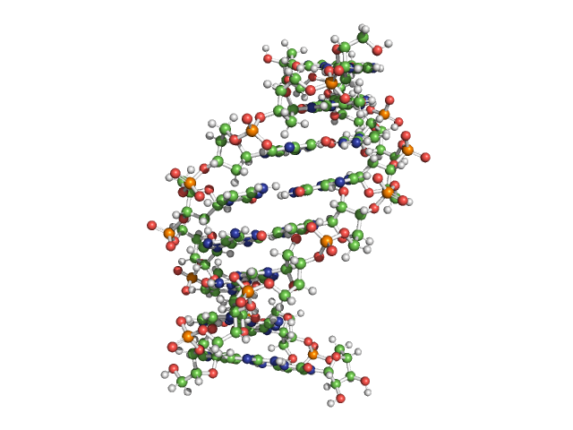
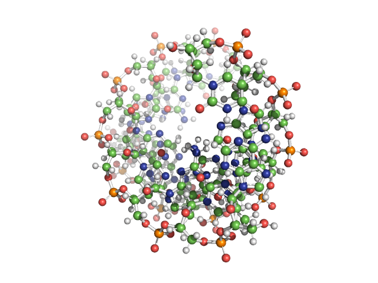

# Tinker ： 多肽和核酸的建模

Tinker分子建模程序包，被设计用于分子建模、动力学模拟以及基于能量的结构优化等工作。不同于其它软件把所有功能都集成到一个程序里，Tinker有着非常好的模块化设计（其实就是塞给你一堆零碎的程序）。

Tinker有一些功能和特性：

1. building protein and nucleic acid models from sequence
2. energy minimization and structural optimization
3. analysis of energy distribution within a structure
4. molecular dynamics and stochastic dynamics
5. simulated annealing with a choice of cooling schedules
6. normal modes and vibrational frequencies
7. conformational search and global optimization
8. transition state location and conformational pathways
9. fitting of energy parameters to crystal data
10. distance geometry with pairwise metrization
11. molecular volumes and surface areas
12. free energy changes for structural mutations
13. advanced algorithms based on potential smoothing


Tinker User's Guide : https://dasher.wustl.edu/tinker/distribution/doc/sphinx/tinker/_build/html/index.html 

一份很不错的教程：https://www.cup.uni-muenchen.de/oc/zipse/teaching/computational-chemistry-1/topics/force-field-calculation-with-tinker/

Community : https://tinkertools.org/ 

Pre-built Binaries : https://dasher.wustl.edu/tinker/

Github Repo : https://github.com/TinkerTools


今天和大家分享的主要是**利用Tinker进行多肽和核酸的建模以及EM**的过程。需要用到的一是从Pre-built Binaries下载的可执行程序（Tinker 8.10.1），二是从github repo下载得到的params文件夹（里面包含了多个力场的参数文件，当然，也可以只下载你需要的参数文件）。

另外，其实**Avogadro**这个小软件就能做到下文要讨论的（几乎）所有事情了，因而可能你也没有继续读下去的必要。


## 多肽的建模

利用Tinker进行多肽的建模需要用的程序和文件主要如下：

- **protein** : 可以自动构建多肽和蛋白结构；支持自定义每一个氨基的phi/psi/omega/chi角度，支持D/L手性，支持首尾成环，支持添加多种capping基团；支持生成多条链；可以交互式输入也可以命令文件输入；输出两种坐标：笛卡尔坐标和分子内坐标。
- **minimize** : 通过L-BFGS算法对输入的结构进行优化，需要输入一个笛卡尔坐标文件、力场参数文件以及一个RMS梯度值；当结构两步优化之间的RMS值小于给定的RMS值时优化结束。
- **xyzpdb** : 可以将.xyz笛卡尔坐标系文件转换成pdb格式的文件，转换的同时需要一个.seq文件（记录了氨基酸序列或者核酸序列信息）作为输入。
- **amber14sb.prm** : 力场参数文件，amber14sb力场。


建模的整个过程大概可以描述为： `protein`程序建模 —— `minimize`程序优化 —— `xyzpdb`程序格式转换。


### protein

首先以交互式的方式执行`protein`程序。



执行之后会要求你输入输出文件的名字，蛋白的名字以及用到的力场文件；按照你的需要输入即可（我的力场文件放在params/目录下）。



之后会有大段儿的提示语。

可以看到，protein程序支持多种氨基酸、多种质子化状态、多种封端。每一行，除了输入氨基酸名字之外，还可以输入多个二面角的角度，氨基酸的手性等等。还可以使用"MOL"来终止一条链并开启一条新链。

每一行的从左到右依次是：氨基酸名字、backbone的三个二面角Phi-Psi-Omega（三个float数字）、R基团角度（四个float数字）、二硫键partner（就是与之形成二硫键的另一个氨基酸的序号）、手性符号（D或者L）。

除了氨基酸名字不能缺省之外，其余的参数都可以缺省，但是要缺省得很有讲究，譬如你要是写`CYX 10 D`，可能你的意思是：此行定义一个D型半胱氨酸，它要与序号为10号的半胱氨酸形成二硫键；但是程序会理解成：你定义了一个D型的缺了一个H原子的半胱氨酸，这个半胱氨酸的Phi还是很奇怪的10°。哈哈哈哈！所以这中间的八个数字，后面的可以缺，但要写后面的前面的数字就必须要有。

简单说明提示语中四个二面角的意思（ C 和N表示形成肽键的C和N，CA就是alpha C了）：

- Phi : dihedral in the chain C - N - CA - C 
- Psi : dihedral in the chain N -CA - C - N 
- Omega : dihedral in the chain CA - C - N - CA
- Chi : dihedral of side chains 



图片出自swiss-model的documentation ，关于chi请参考 https://swissmodel.expasy.org/course/text/chapter3.htm。


一般定义Phi和Psi就基本上可以定义二级结构了（因为肽平面的关系，Omega一般都是180度，少见0度）。Alpha helix的这Phi和Psi一般是 -60°和-50°，beta sheet 的这俩角度一般是-140°和130° ；当然，这是很**粗略**的值。而chi的常见取值则是 -60°、60°和180°。


#### 最简单示例

下面咱构建一个10肽，`ALSALSRDME` ：

```protein
 Use Residue Name=MOL to Start a New Chain, and Use <Enter> to End Input
 Enter Residue   1 :  A
 Enter Residue   2 :  L
 Enter Residue   3 :  S
 Enter Residue   4 :  A
 Enter Residue   5 :  L
 Enter Residue   6 :  S
 Enter Residue   7 :  R
 Enter Residue   8 :  D
 Enter Residue   9 :  M
 Enter Residue  10 :  E
 Enter Residue  11 :
 Cyclize the Polypeptide Chain [N] :
```

按提示依次输入氨基酸名字。当然你也可以输入三个字符的氨基酸名字。结束的时候就什么也不输入直接回车。最后程序会询问你要不要把输入的多肽做成环肽（默认是不），我们就直接回车；如果你需要，输入Y或者y就可以生成环肽了。

程序结束之后，会在当前目录生成三个文件：test.xyz、test.seq、test.int；分别是笛卡尔坐标系的多肽坐标文件、多肽序列文件以及多肽的分子内坐标文件。

protein程序进行多肽建模的基本过程就是如此。在进行EM和坐标文件格式转换之前，让我们来看看更多的多肽生成示例。


#### D-氨基酸

程序默认输入的是L型氨基酸，如果你需要D型的，直接在每行的末尾加上`D`就可以了。

```protein
 Use Residue Name=MOL to Start a New Chain, and Use <Enter> to End Input
 Enter Residue   1 :  A
 Enter Residue   2 :  L
 Enter Residue   3 :  S D
 Enter Residue   4 :  A D
 Enter Residue   5 :  L D
 Enter Residue   6 :  S
 Enter Residue   7 :  R D
 Enter Residue   8 :  D
 Enter Residue   9 :  M D
 Enter Residue  10 :  E
 Enter Residue  11 :
 Cyclize the Polypeptide Chain [N] :
```


#### 自定义二级结构

让我们给上面的DL混合型10肽加点儿二级结构，把定义二级结构的角度家在名字后面，手性前面就可以了。

```protein
 Use Residue Name=MOL to Start a New Chain, and Use <Enter> to End Input
 Enter Residue   1 :  A -60 -50
 Enter Residue   2 :  L -60 -50
 Enter Residue   3 :  S -60 -50 D
 Enter Residue   4 :  A -60 -50 D
 Enter Residue   5 :  L -60 -50 D
 Enter Residue   6 :  S -60 -50
 Enter Residue   7 :  R -60 -50 D
 Enter Residue   8 :  D -60 -50
 Enter Residue   9 :  M -60 -50 D
 Enter Residue  10 :  E -60 -50
 Enter Residue  11 :
 Cyclize the Polypeptide Chain [N] :
```

看看结果：




#### 两条链 + cappings

当然我们也可以同时构建两条链，并各自加上首尾的cappings。

```protein
 Use Residue Name=MOL to Start a New Chain, and Use <Enter> to End Input
 Enter Residue   1 :  ACE
 Enter Residue   2 :  A
 Enter Residue   3 :  A
 Enter Residue   4 :  A
 Enter Residue   5 :  NME
 Enter Residue   6 :  MOL
 Enter Residue   6 :  PCA
 Enter Residue   7 :  A
 Enter Residue   8 :  A
 Enter Residue   9 :  A
 Enter Residue  10 :  NME
 Enter Residue  11 :
 Cyclize the Polypeptide Chain [N] :
```




我测试的时候，某些capping加出来的结构不太理想，可能和力场有关，大家根据自己需要自行测试吧。


#### 质子化 + 环状肽

`protein`程序提供了多种质子化状态的氨基酸，接下来我们构建一个包含多个不同质子化状态的组氨酸的环状肽。

```protein
 Use Residue Name=MOL to Start a New Chain, and Use <Enter> to End Input
 Enter Residue   1 :  HIS
 Enter Residue   2 :  HIE
 Enter Residue   3 :  HID
 Enter Residue   4 :  HIP
 Enter Residue   5 :  HIS
 Enter Residue   6 :  HIE
 Enter Residue   7 :  HID
 Enter Residue   8 :  HIP
 Enter Residue   9 :
 Cyclize the Polypeptide Chain [N] :  Y
```

**minimize**之后会得到一个很小的环，由不同质子化状态的组氨酸组成。




我测试的时候，某些质子态氨基酸构建出来的结构不太理想，可能和力场有关，大家需要的时候自行测试吧。


#### Disulfide Bond

接下来我们尝试构建一个包含二硫键的多肽。

```protein
 Use Residue Name=MOL to Start a New Chain, and Use <Enter> to End Input
 Enter Residue   1 :  A
 Enter Residue   2 :  A
 Enter Residue   3 :  CYX -120 120 180 -60 60 180 -60 8 D
 Enter Residue   4 :  A
 Enter Residue   5 :  A
 Enter Residue   6 :  A
 Enter Residue   7 :  A
 Enter Residue   8 :  CYX -120 120 180 -60 60 180 -60 3 L
 Enter Residue   9 :  A
 Enter Residue  10 :  A
 Enter Residue  11 :
 Cyclize the Polypeptide Chain [N] :
```

经过**minimize**之后，看看结果：



可以看到，这个二硫键还是很不错的，连接着这两个手性不同的半胱氨酸。

因为描述CYX的partner的是一个氨基酸序号(Int)，所以前面的七个二面角的数据不可省略，必须全部写出来，不然这个Int数字会被解释成前面的二面角数据。

那如果不知道前面的这七个数据怎么办？没事儿，可以乱写一气，只要数字的个数对就成，反正minimize之后都很正常（有力场，有恃无恐）。比如上面的例子中CYX的两句可以写为：

```protein
......
CYX 0 0 0 0 0 0 0 8 D
......
CYX 0 0 0 0 0 0 0 3 L
......
```

但一定要记得minimize，不然连二硫键都莫得。


#### 文件输入

`protein`程序除了可以交互式运行之外，还可以以命令脚本的形式运行；也即把所有交互式运行时候的命令写进一个文本文件，然后将整个文本文件作为`protein`的输入即可。

例如上述的二硫键的例子，可以写成如下的一个脚本文件disulfide.txt ：

```disulfide.txt
test
test
params/amber14sb
A
A
CYX -120 120 180 -60 60 180 -60 8 D
A
A
A
A
CYX -120 120 180 -60 60 180 -60 3 L
A
A

N
```

前三行分别指定了文件名字、多肽名字、力场文件，从第4行到第13行定义了10个氨基酸，第14行直接回车表示多肽构建结束，第15行N表示不要生成环肽。

输入文件弄好了之后像这样运行：

```protein
protein.exe < disulfide.txt
```

生成的结果跟交互式运行的结果是一样的。


### minimize

涉及到共价键形成的，一定要做minimize，比如说成环或者二硫键。因为它构建蛋白质的时候，预计要形成共价键的两个原子可能相距甚远（比如二硫键的两个硫原子），需要通过`minimize`应用力场来调整结构。

`minimize`程序同样提供了两种运行方式：交互式或者命令行。

首先以交互式运行：

```minimize
 Enter Cartesian Coordinate File Name :  test.xyz
 Enter Parameter File Name [<Enter>=NONE] :  params/amber14sb
 Enter RMS Gradient per Atom Criterion [0.01] :  1
```

首先会要求你输入要优化的坐标文件名字（test.xyz），然后输入相应的力场参数文件，最后是一个RMS梯度值。当两步优化之间，单原子的RMS差值小于你设定的值时，优化就结束了；默认是0.01，（但可能会较大地改变你设定的二级结构），我这里设定其为1.0 。回车之后优化就会开始，一段时间之后就会结束。

结束之后的提示语大概如下：

```minimize
 LBFGS  --  Normal Termination due to SmallGrad

 Final Function Value :           55.7958
 Final RMS Gradient :              0.9626
 Final Gradient Norm :             9.7689
```

正常结束，已经达到优化要求了。程序会把优化之后的结构存成另一个.xyz文件，在这里的例子中是 test.xyz_2 。

当使用命令行形式调用`minimize`程序的时候，只需要把交互式要输入的参数按顺序写在命令行里就可以了。

```minimize
minimize test.xyz params/amber14sb 1.0
```

结果是一样的。


### xyzpdb

如果我们还需要获得pdb格式的文件的话，就需要利用`xyzpdb`程序进行格式转换。`xyzpdb`程序只需要两个参数，一个xyz坐标文件，一个力场参数文件；同样的，`xyzpdb`也有两种调用的方式，交互式和命令行。

交互式：

```xyzpdb
 Enter Cartesian Coordinate File Name :  test.xyz_2
 Enter Parameter File Name [<Enter>=NONE] :  params/amber14sb
```

命令行：

```xyzpdb
xyzpdb test.xyz_2 params/amber14sb
```

程序执行完成之后，就会得到相应的pdb文件了！


### key文件

不管什么程序，好像都要输入一遍力场参数文件，是不是挺麻烦的？

也可以参照官方文档，在工作目录里面添加一个key文件，然后在key文件内指定力场。每一个程序启动时都会自动检测key文件的内容，就不用自己每次指定力场文件了。需要注意key文件的命令需要与你的分子系统的名字一致。

比如说对于上面的体系，key文件的名字应该为 test.key 。test.key的内容如下：

```key
parameters /path/to/amber14sb.prm
```


除了力场，key文件里还可以设定其它变量。更多信息请参考 https://dasher.wustl.edu/tinker/distribution/doc/sphinx/tinker/_build/html/text/keywords.html


## 核酸的建模

利用Tinker进行核酸的建模需要用到的程序和文件主要如下：

- **nucleic** : 可以自动构建核酸结构；支持自定义磷酸骨架角度；支持A-、B、Z 三种分子结构；支持DNA和RNA；支持生成多条链；可以自动从单链序列生成双链结构（via rigid docking）；输出笛卡尔坐标文件和文字内坐标文件。
- **intxyz** : 可以将.int分子内坐标文件转换成.xyz笛卡尔坐标文件。
- **minimize**
- **xyzpdb**
- **amber14sb.prm**


核酸建模的过程和多肽建模的过程是类似的：`nucleic`程序建模 —— `minimize`程序优化 —— `xyzpdb`程序做格式转换。当然，minimize这一步可以视情况省略。

### nucleic

首先我们以交互式运行`nucleic`程序：



按照程序提示依次输入：输出文件名、分子名、力场文件、DNA构型。DNA默认是B型的，你也可以选择A型或者左手螺旋的Z型。

然后就是需要输入碱基名字了，顺序是从5‘到3’。对于DNA来说，脱氧核糖核苷酸名字分别是 **DA**、**DT**、**DG**、**DC**；对于RNA则是**A**、**U**、**G**、**C**。每一行的碱基名字后面还可以追加六个Backbone Torsions 和一个Glycosidic Torsion；我对DNA的这种结构细节不太熟悉，就不班门弄斧了。同样的，可以使用MOL来新建一条链。

接下来让我们生成一个DNA和RNA混合的双链结构：

```nucleic
 Use Residue=MOL to Start a New Strand, and Use <Enter> to End Input
 Enter Residue   1 :  DA
 Enter Residue   2 :  DT
 Enter Residue   3 :  DG
 Enter Residue   4 :  DC
 Enter Residue   5 :  A
 Enter Residue   6 :  U
 Enter Residue   7 :  G
 Enter Residue   8 :  C
 Enter Residue   9 :
 Build a Double Helix using Complimentary Bases [N] :  Y
```

先输入了四个脱氧核糖核苷酸，接着输入了四个核糖核苷酸，最后`Y`表明需要构建成双链儿的。

构建完成之后，转化一下格式：

```bash
xyzpdb test.xyz params/amber14sb
```

我这里就没有minimize了，双链DNA/RNA优化之后会稍微有点儿散开（minimize应该是真空条件的）。

看看构建出来的结果：





结构还是非常可靠的！

但是似乎有个小bug，（脱氧）核苷酸的名字似乎没能正确写入到pdb文件中，本来应该是`DA`之类的地方现在是一堆数字，可能是力场问题，也可能真就需要自己改改了。


## Others

以上内容阐述了利用Tinker的少数几个程序进行多肽和核酸建模的过程。程序的使用体验还是非常不错的，模块化的设计也很容易将其嵌入到其它的工作流当中。当然，Tinker还包含其它优秀的模块。

只可惜，Tinker可能属实是个小众的软件了，即使英文的资料似乎也不多。

谨以此文，为Tinker的中文社区（如果有的话）做做贡献吧。


祝各位安~


