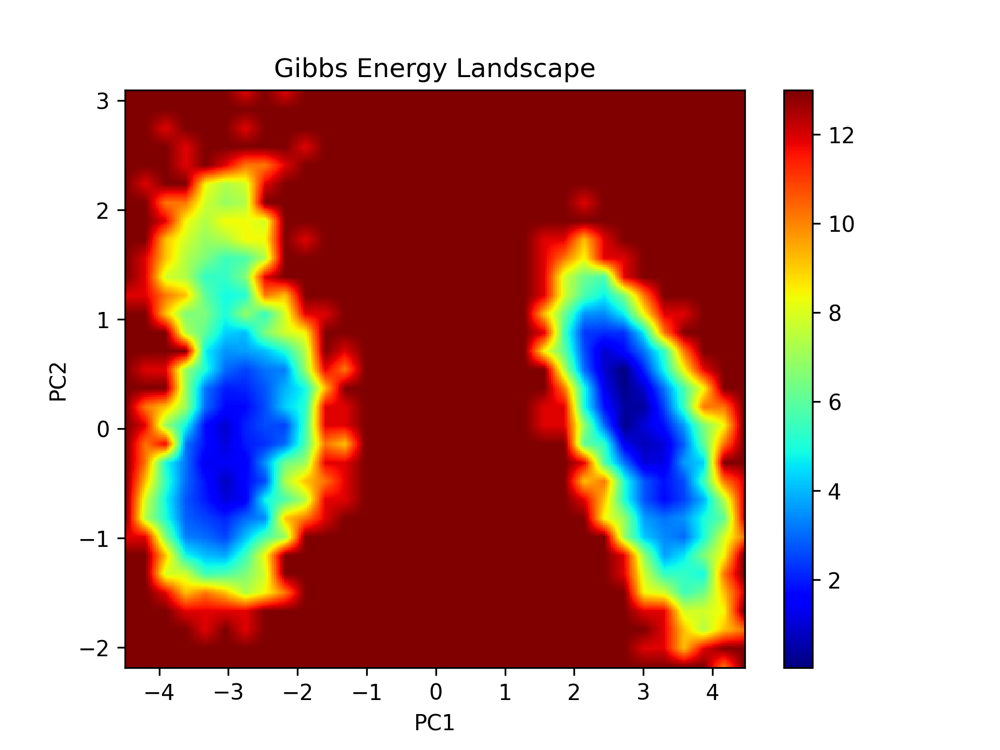
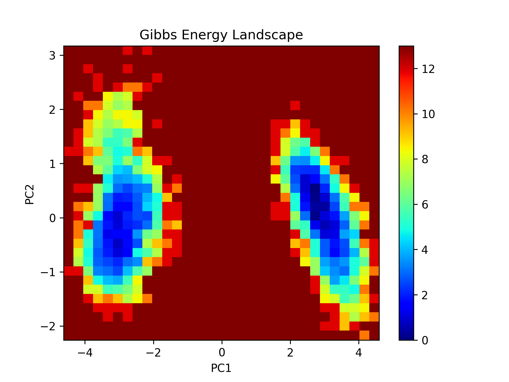
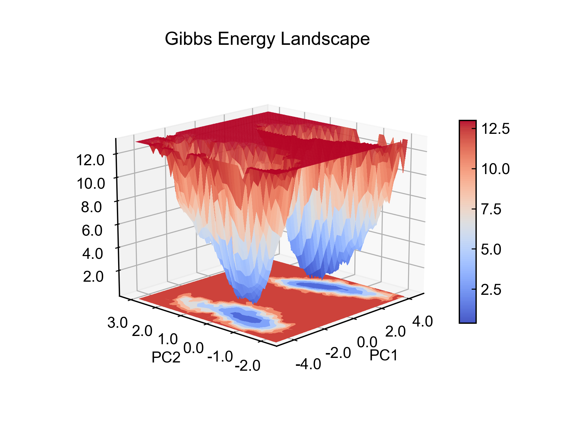
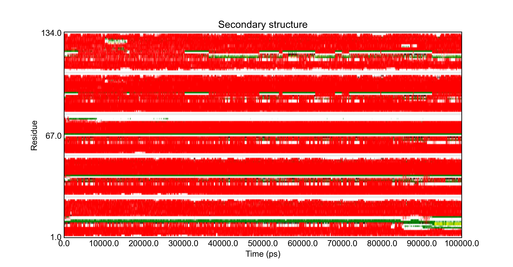
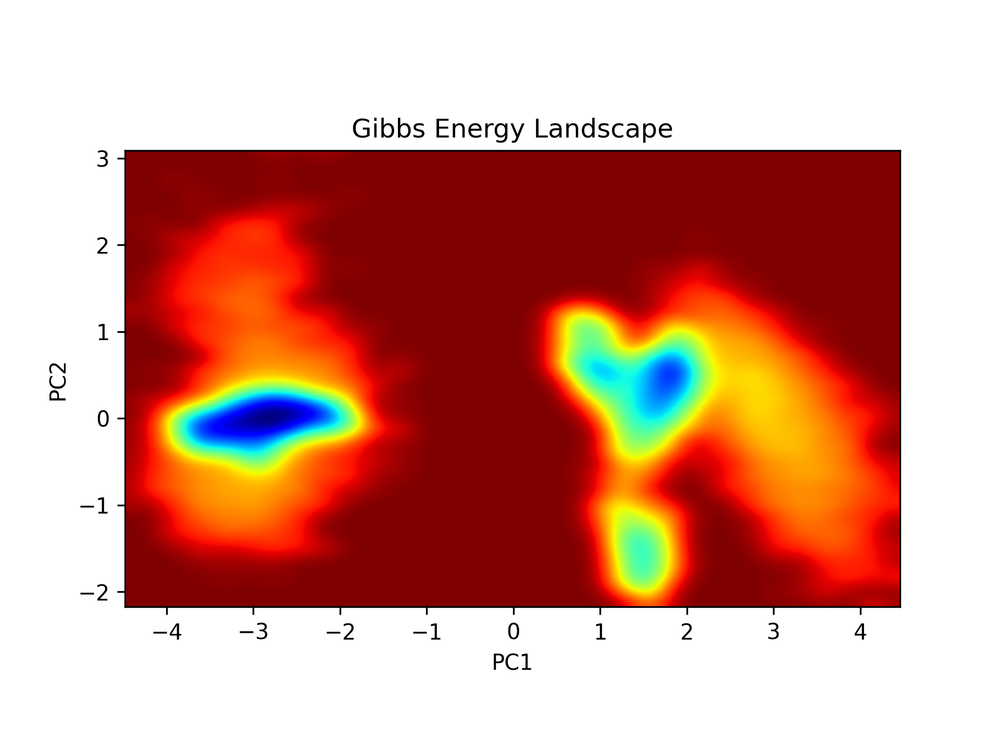

# xpm_show.py 新的xpm文件可视化

### Intro

趁有空重构了之前的xpm2png.py，优化了一部分内容，也整合了一些新的功能。很高兴能分享给大家。


### Functions

#### xpm直接转换为图片

原来的xpm2png的脚本就已经具有这个功能了，也能对图片插值（仅对于Continues类型的xpm）。

现在的xpm_show则增加了两种图片的呈现方式。原本是直接解析出图片的像素然后plt.imshow绘制，现在对于Continues类型的xpm可以用plt.pcolormesh函数绘制，较之之前有了更丰富的色彩呈现，也可以自适应屏幕了；对于Continues类型的xpm还增加了绘制3D图的功能。当然，对图片插值美化的功能依旧保留了。

对于Discrete类型的xpm，现在绘制得到的图形也可以自适应屏幕了。

下面是对xpm进行可视化的各种可能用到的命令：

```bash
# 以原始方式可视化test.xpm
xpm_show.py -f test.xpm
# 对图片进行插值，仅支持Continues类型的xpm
xpm_show.py -f test.xpm -ip 
# 使用pcolormesh来呈现xpm
xpm_show.py -f test.xpm -pcm 
# 对pcolormesh呈现的图片进行插值
xpm_show.py -f test.xpm -pcm -ip
# 绘制3D图
xpm_show.py -f test.xpm -3d
# 绘制3D图并插值
xpm_show.py -f test.xpm -3d -ip
# 对图片插值，并将结果保存到test.png，dpi为300
xpm_show.py -f test.xpm -ip -o test.png
# 添加-ns，表示不弹出窗口绘图而是直接将结果保存到png文件
# 对于某些集群或者没有gui的电脑，这个或许有用
xpm_show.py -f test.xpm -ip -ns -o test.png
```










当然，之前存在的一些小问题依旧没有得到解决：对于Discrete类型的xpm，它的坐标轴的刻度值不太好搞，总是不是很均匀，还很需要改进.


#### xpm转为csv数据

有同学需要这样的功能，将xpm里面每一个像素点对应的横纵坐标值以及像素点的值导出，方便用其它的绘图软件处理。

导出用到的参数是`-e`，用的extract这个单词的首字母，或者你写全称也成的：

```bash
xpm_show.py -e test.xpm
```

程序会把test.xpm里面的数据导出到test.csv文件中。这里没有指定输出csv文件的名字，程序会使用xpm文件同样的名字。当然，如果需要的话，我也可以把指定输出文件名的功能加上，目前不太想写这一部分的条件判断。

需要注意的是，对于某些xpm，比如说`gmx sham`命令生成的形貌图，它里面的横纵坐标值的数量比实际值多一个，也就是给出的是边界值。李继存老师xpm2all.bsh脚本里面的做法是直接去掉了最后一个值。我这里编码的稍有不同，我求了相邻两个值的平均，也就是间值。故而结果稍有不同！需要自行验证！

#### xpm2gpl

Gnuplot是一个很厉害的绘图工具，李老师的脚本里有将xpm转换成gnuplot绘图脚本的功能。我之前也用Go语言写过将xpm转换成gnuplot脚本文件的程序xpm2gpl，提供了源代码和windows下的可执行程序。这个功能对于`gmx dssp`得到的蛋白质二级结构图（Discrete类型）很有用，gnuplot绘图得到的效果确实没得说。当初就是因为看不懂用bash和awk写的xpm2all.bsh脚本，因为才写了xpm2gpl。很可惜，估计没多少人用吧，大多数能用到这个的朋友多半都是linux机子，exe程序就没用了，装个go编译器？似乎也没必要。

于是我把xpm2gpl的功能也整合到xpm_show里面来了，可以通过`-g`参数将xpm文件转换成gnuplot绘图会用到的.gpl脚本。使用如下：

```bash
xpm_show.py -g test.xpm
```

之后就会在工作路径中找到生成的同名gpl文件，在这里就是test.gpl。在终端里执行如下命令：

```bash
echo load "test.gpl" | gnuplot
```

或者进入到gnuplot的绘图终端然后执行：

```gnuplot
load "test.gpl"
```

就可以绘图了。绘图结束之后就会在工作路径中得到和xpm同名的png文件，在这里也就是test.png。

当然，如果你需要修改某些绘图的参数，可以自行编辑gpl脚本（主要可以修改开头和最后的部分）。

对于二级结构图，效果应该很不错的：


对于Continues类型的xpm，表现也不错：


#### 合并xpm

还有一个或许没啥用的功能，合并xpm，也即把不同的xpm文件合并成同一张图片，仅对于Continues类型的xpm适用。

合并的过程是这样的，先抽提出每个xpm中每一个像素的横纵坐标以及数值信息，然后将这些数据绘制成散点图，再在散点图的基础上使用高斯过滤来获得最终的图片。

参数是`-c`，然后把要合并的多个文件添加到后面就可以了，同样可以使用`-ns`和`-o`这两个参数。

```bash
xpm_show.py -c test_1.xpm test_2.xpm
```



就代码本身而言，还有一个主要的问题：如何判断两个xpm图片里的坑是不是同一个？！目前我是直接把像素点的数值叠加了，也就是同一个坑可能被叠加了两次，变得更深了，而这显然并不符合实际情况。

**还有一个问题需要特别注意：叠合xpm的物理意义是什么？！**

譬如说两段儿轨迹通过各自的PCA做出来的主成分1和2，再通过`sham`生成了xpm，这时候就不能合并xpm了，因为两次PCA得到的主成分的物理意义是不一样的。如果是RMSD和Gyrate的xpm，或许还可以试一试。

当然，目前的代码还特别蠢，为什么不直接利用`sham`命令需要的数据绘制散点图然后生成图片呢？哎哈哈哈哈

如果有朋友需要多个FEL组合的那种图，可以考虑**合并轨迹**然后再绘图（此处感谢李英南同学）。

总的来说，这个功能还在测试中，**不建议使用**。


### Parameters

下面是xpm_show.py的所有可能用到的参数：

```bash
$ python xpm_show.py -h
usage: xpm_show.py [-h] [-f INPUTFILE] [-o OUTPUTPNG] [-ip] [-pcm] [-3d] [-ns]
                   [-c COMBINE [COMBINE ...]] [-e EXTRACT [EXTRACT ...]]
                   [-g GNUPLOT [GNUPLOT ...]]

Process xpm files generated by GMX

optional arguments:
  -h, --help            show this help message and exit
  -f INPUTFILE, --inputfile INPUTFILE
                        input your xpm file
  -o OUTPUTPNG, --outputpng OUTPUTPNG
                        picture file to output
  -ip, --interpolation  whether to apply interpolation (only support
                        Continuous type xpm)
  -pcm, --pcolormesh    whether to apply pcolormesh function to draw
  -3d, --threeDimensions
                        whether to draw 3D figure
  -ns, --noshow         whether not to show picture, useful on computer
                        without gui
  -c COMBINE [COMBINE ...], --combine COMBINE [COMBINE ...]
                        specify some xpm files to combine into one figure
  -e EXTRACT [EXTRACT ...], --extract EXTRACT [EXTRACT ...]
                        specify xpm files to extract scatter data and save to
                        csv file
  -g GNUPLOT [GNUPLOT ...], --gnuplot GNUPLOT [GNUPLOT ...]
                        specify xpm files to convert into gnuplot scripts
                        (.gpl file)
```

`-e` ；从xpm中抽提散点数据并存到csv文件中。

`-g`：从xpm中读取信息会生成gnuplot绘图脚本。

`-c`：合并多个xpm图像，可联合`-o`、`-ns`使用；**不建议使用此功能！**

`-f`：读入xpm文件，只可读入一个，默认对xpm使用原来的方法绘制。

`-o`：指定输出png的名字，可与`-f`或`-c`联用。

`-ns`：不展示图片，对没有GUI的机子适用。

`-ip`：是否对图形进行插值，可与`-f`、`-pcm`、`-3d`联合使用。

`-pcm`：使用pcolormesh函数对`-f`读入的xpm文件进行绘制，可与`-ip`联合使用（可插值）。仅对Continues类型的xpm适用。

`-3d`：对`-f`读入的xpm文件绘制3d图，可与`-ip`联用（可插值）。仅对Continues类型的xpm适用。


###Others

上述代码没有经过完善的测试，使用的时候还是要自己小心检查。

代码位置：https://github.com/CharlesHahn/DuIvy/blob/master/sources/xpm_show/xpm_show.py

非常欢迎大家读代码、Issue和PR。

代码注释不多，写得也烂，见谅。

