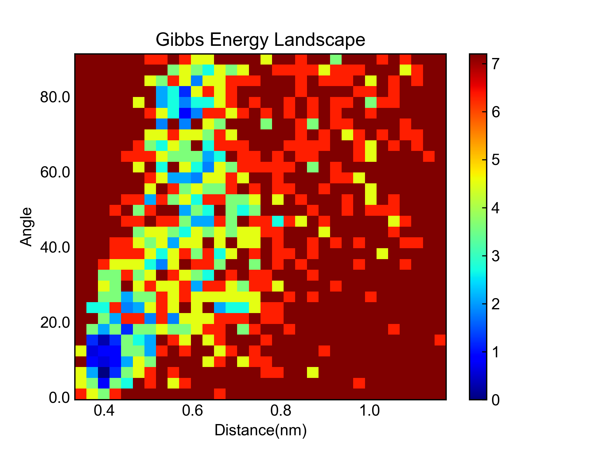
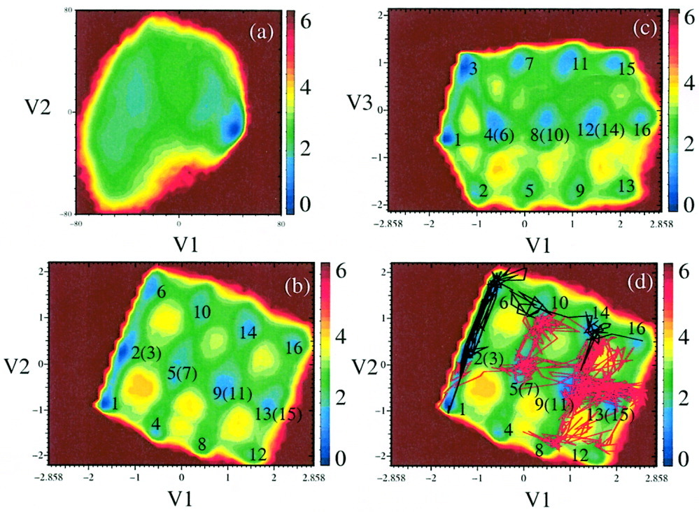
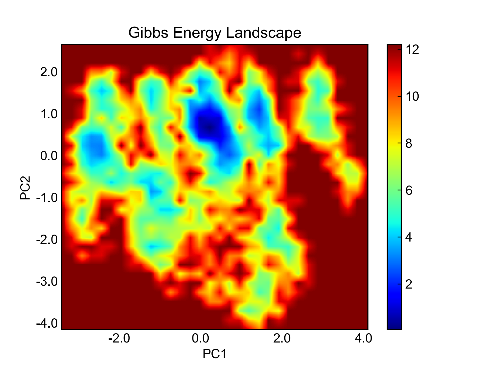
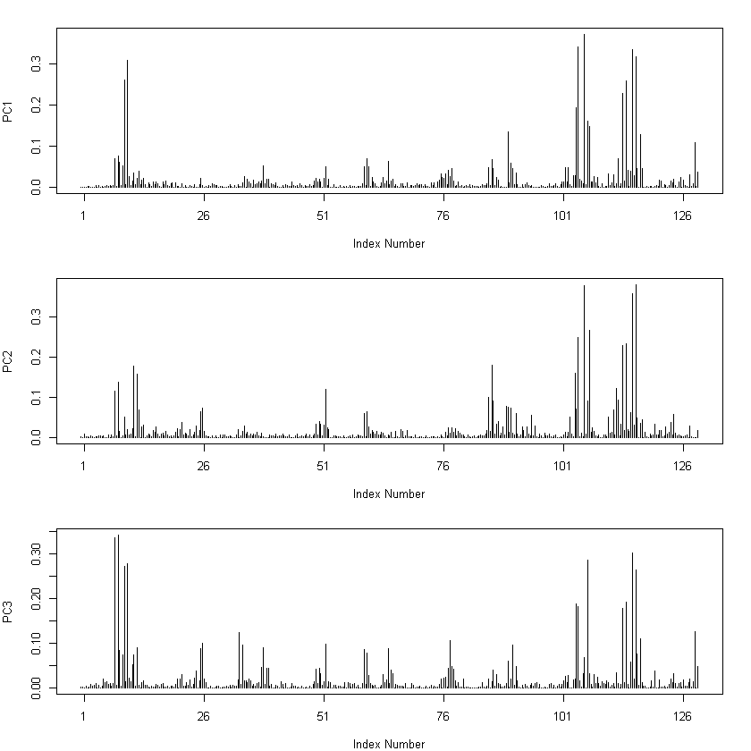
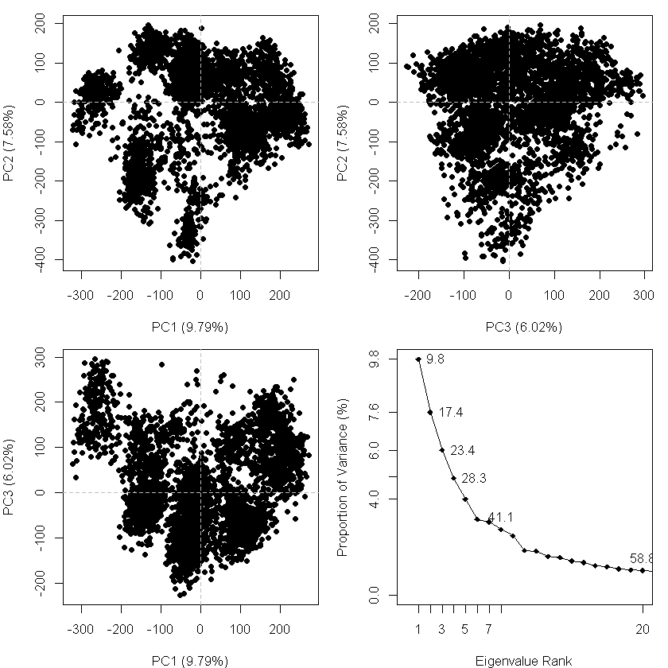

# dPCA 二面角主成分分析

dPCA相关的资料较少，谨以此文与大家讨论学习，非常欢迎argue和issue！


## sham命令与自由能形貌图

通常情况下（简单情况下），GROMACS的sham命令可以利用**两个变量的数据**通过玻尔兹曼反转多维直方图(Bolzmann inverting multi-dimensional histograms)的方法计算Gibbs自由能形貌图；粗浅地理解，实际上就是把这两个变量的数据构成的散点图转换成形貌图，散点密集的地方能量更低（概率密度P(x)大， G(x)就低）。

$$ G(x) = -kT*Ln(P(X)) + c$$

而这两个变量，可以由你任意指定；当然，最好是对体系的运动有一定的代表性的变量。对于蛋白质的模拟而言，最常见的这一对变量或许是RMSD和Gyrate，又或者是PCA得到的主成分1和主成分2。但请不要局限于此，这两个变量可以任意指定，只要足够表征体系的运动趋势即可。

譬如说，笔者之前写过一篇《计算苯环之间的距离和夹角》，其中有涉及到姜黄素的两个苯环之间的距离和法向夹角的计算。实际上，这两个变量就可以作为sham的输入，得到的gibbs形貌图如下：



自然，因为这两个变量的噪音以及代表性的问题，这个图看起来似乎有点儿糟糕。

同样的，你也可以指定角度、二面角、距离等等变量来计算自由能形貌图。


## PCA主要是为了降维

主成分分析和自由能形貌图的绘制，这完全是两个东西，但是有些时候也经常一起出现。

要绘制可靠的自由能形貌图，自行指定的两个变量通常很难确定其是不是足够代表体系的变化和运动。因而，我们才考虑将体系所有原子的三维坐标作为变量。但如此就有了变量维度太高的问题，我们希望从这高维数据中获取到最具代表性的低维数据，因而才应用了PCA这个方法。

PCA的主要目的是降维。在一般的情况下，PCA主要将体系各种复杂的运动和变化约化到低维，并尽可能保持高维的信息。譬如最常见的PCA，是将3N个笛卡尔坐标通过协方差矩阵对角化转化成3N个本征向量和本征值，一般来说，前几个本征向量就足以描述大部分的体系的运动和变化了。


## dPCA

我们已经从“自行选择两个变量”进化到“通过PCA对体系原子笛卡尔坐标进行分析，得出两个主成分作为变量“了。

但是笛卡尔坐标系在这里仍旧存在一些缺陷：平动和转动不可避免地会对体系的笛卡尔坐标产生影响；即使对轨迹进行了校正，这些影响依旧会有部分保留，并为分子内运动和变化的分析带来噪音。

因而人们想到了使用分子内坐标(internal coordinate)，并进一步想到使用二面角(dihedral)来作为变量。

使用分子内坐标可以有效剥离体系整体平动和转动带来的影响。使用二面角作为变量又可以进一步减少CV。

我们来看2005年文章(https://doi.org/10.1002/prot.20310)中的一张penta-alanine的FEL图：



a图是笛卡尔坐标PCA得到的FEL，b、c都是通过dPCA得到的FEL，d图则是折叠的路径。

很明显！通过dPCA做出来的FEL显示了更多能量细节，而笛卡尔坐标得到的FEL则只有一个极小值，大部分区域都被整体运动掩蔽了。

因而，在多肽以及生物大分子等相关体系中，dPCA或许能取得更好的表征效果。

dPCA虽然使用二面角作为变量，但是其与笛卡尔坐标这种变量还有一个很大的不同。一个原子的坐标的取值，可以从负无穷到正无穷，而二面角的取值却是-pi到pi，且有周期性。为了更好的利用现有的PCA手段，需要对角度做一个处理，也即将之写为:


对于笛卡尔坐标系中的一个原子，我们用3个坐标值去表征；而对于一个二面角，我们用sin和cos两个值去表征。（记着这一点，后面的2*N/3的dirty hack就好理解了）。

后面的PCA的过程就是一样的，构建协方差矩阵，对角化，得到本征向量和本征值。

关于dPCA的更多细节，可以参考 https://aip.scitation.org/doi/10.1063/1.2746330


## gmx method

这一小节介绍通过gmx进行dPCA并绘制FEL的方法。

在这个例子中我要做的是对一个蛋白五聚体backbone的模拟轨迹进行dPCA。轨迹已经做过了周期性校正，且轨迹中只保留了backbone；文件为backbone.xtc和backbone.tpr。

#### 制作二面角的ndx索引文件

首先第一步是写一个体系中二面角的索引文件，里面包含的自然就是你在意的二面角的原子编号了。

**可以手写**，如果你想要分析的二面角个数较少的话。直接把二面角涉及到的原子的编号写到索引文件里面就行了。四个原子为一个二面角，且要注意顺序，建议用pymol或者vmd等工具一边查看一边写。

更方便的，直接用`mk_angndx`命令生成就行了。比如说这里，我要分析的是backbone中所有的二面角。

执行下面命令生成索引(dangle.ndx)：

```bash
gmx mk_angndx -s backbone.tpr -n dangle.ndx
```

因为我的蛋白是个五聚体，分析的又是backbone，因而一共有15个索引组（5 * 3 phi、omega、psi）。

咱分析所有的二面角，因而这里把所有索引组组合成一个索引组，就命名为backbone吧。你可以用`make_ndx`命令编辑索引文件，或者直接手动编辑。

如此，我们就把所有要分析的二面角涉及到的原子的序号都添加到索引里面了。

#### 2. 抽提二面角的轨迹

接下来，我们利用`angle`命令从轨迹中提取二面角的信息。

```bash
gmx angle -f backbone.xtc -n dangle.ndx -or dangle.trr -type dihedral
```

在这条命令的输出里，有一些关键信息需要大家注意：

```bash
There are 285 dihedrals. Will fill 190 atom positions with cos/sin
Found points in the range from 0 to 359 (max 360)
 < angle >  = 31.2433
Order parameter S^2 = 0.252726
```

轨迹里一共有285个dihedral，填充了**190**个蛋白质的位置。

这一句话非常关键，理解这个信息对于理解后面两步至关重要。trr轨迹文件，本是设计用来存储笛卡尔坐标的，也即，一个原子对应X、Y、Z三个维度的数值。前面我们阐述了，dPCA是sin和cos，也即只有两个数字。要用gmx的`covar`来进行dPCA，也就需要将2个数字塞进原本装3个数字的trr文件里。

于是，一个”dirty hack"产生了。我们把二面角的这俩数据依次放到trr文件里，3个二面角（3*2=6个数据）就占据了原来2个原子坐标信息的位置。

因而，这里说285个二面角，一共装了190个原子的位置（也即2*N/3并向上取整，如有空位置就用0占位了）。


#### 3. 制作协方差矩阵计算需要的ndx索引文件

对比一下普通PCA，`covar`命令需要笛卡尔坐标数据(trr文件)，对应的索引文件、以及对应的结构文件(tpr或者gro)。我们现在只有了二面角信息的trr文件。

这一步构造的就是索引文件。

前面提到了，dangle.trr文件里面用190个原子坐标信息的位置存储了285个二面角信息。因而，这里我们要写的索引文件就应该是1到190，也即保证到时候PCA运算的时候用的是这190个原子坐标信息位置存储的二面角数据。

这里我就手写了，并把文件名命名为covar.ndx， 里面包含一个索引组[ backbone ]，索引组里是从1到190共190个数字。


#### 4. 生成gro文件

构造完了索引文件，还需要构造一个结构文件。

```bash
gmx trjconv -s backbone.tpr -f dangle.trr -o resized.gro -n covar.ndx -e 0
```

backbone.tpr这个文件里是包含了结构信息的。dangle.trr在这里完全就是凑数的。实际上，就是把backbone.tpr里面的前190个原子的信息，放到了resized.gro里面。

问题有了！前190个原子，和二面角的信息完全也对不上啊？没关系！是些什么原子不重要，咱只要190这个数对得上就成。后面协方差对角化的时候，`covar`命令会从这个resized.gro里面读取结构信息。它一读：“哦！190个原子！”，于是它就从dangle.trr里面读取前190个原子的信息，实际上也就是读取的我们存进去的二面角的信息了。


#### 6. 执行协方差矩阵的对角化计算

之后就是正常的执行`covar`计算了。

```bash
gmx covar -f dangle.trr -n covar.ndx -s resized.gro -ascii -xpm -nofit -nomwa -noref -nopbc 
```

`-ascii`和`-xpm`都是让输出相关的数据的(covar.dat和covar.xpm)。`-nofit`、`-nomwa`、`-noref`、`-nopbc` 这几个参数则很有必要，这几个参数都是告诉`covar`命令，别按照处理笛卡尔坐标的套路处理我的数据，你直接diagonallization就完了。

程序执行很快，生成的文件和普通PCA的没啥差别。


#### 7. 抽提前两个本征向量并绘制FEL

抽提前两个向量，然后组合，并用`sham`命令生成FEL，绘图就完事儿：

```bash
gmx anaeig -v eigenvec.trr -f dangle.trr -s resized.gro -first 1 -last 1 -proj pc1.xvg
gmx anaeig -v eigenvec.trr -f dangle.trr -s resized.gro -first 2 -last 2 -proj pc2.xvg
pc_combine.py pc1.xvg pc2.xvg pc12.xvg
gmx sham -tsham 310 -nlevels 100 -f pc12.xvg
```



案例中使用的五聚体的结构在模拟过程中几乎没有变化，在dPCA做出来的FEL图上，倒确实能看到很多小细节。


## Bio3D

这一小节介绍通过bio3d程序包进行模拟轨迹dPCA的方法。

bio3d程序包做笛卡尔坐标PCA的教程倒是有现成的，但是dPCA的我却没怎么看见，找了几条语句，看起来似乎像样，但结果却总是和gmx做出来的有点儿差别。我不会R语言，因而也只能模棱两可给出个大概的代码。权做与大家讨论，实在不敢保证对错。**用之请一定审慎**。

轨迹文件backbone.xtc可以用mdconvert或者vmd转成dcd格式。

```R
library("bio3d")
trj <- read.dcd("backbone.dcd")
tor <- t(apply(trj, 1, torsion.xyz, atm.inc=1))
gaps <- gap.inspect(tor)
pc.tor <- pca.tor(tor[,gaps$f.inds])
plot.pca.loadings(pc.tor)
plot(pc.tor)
```





这是前三个向量的柱状图。




这是前三个向量的散点图。

**我也不知道靠不靠谱，知识有限，万望懂dPCA、bio3d或者R的大佬指点一二**


## Others

相关资料：

1. https://mailman-1.sys.kth.se/pipermail/gromacs.org_gmx-users/2017-March/111406.html
2. https://www.gromacs.org/Documentation_of_outdated_versions/How-tos/Dihedral_PCA
3. http://sobereva.com/73
4. https://rdrr.io/cran/bio3d/man/pca.tor.html
5. http://jerkwin.github.io/GMX/GMXtut-0/#14-g_angle进行二面角主成分分析


上述几段资料里有dPCA的教程、关于”dirty hack“的说明，也有R的代码等等；放在这里供诸位参考。

文中提到了早期的两篇有关dPCA的文章，也很有阅读价值，关于dPCA的一些质疑和讨论非常有意思。


冬去春来，寒暑易节，祝各位好~