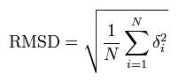
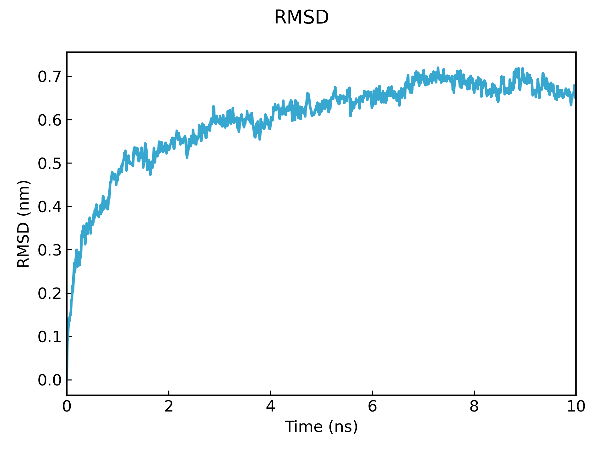
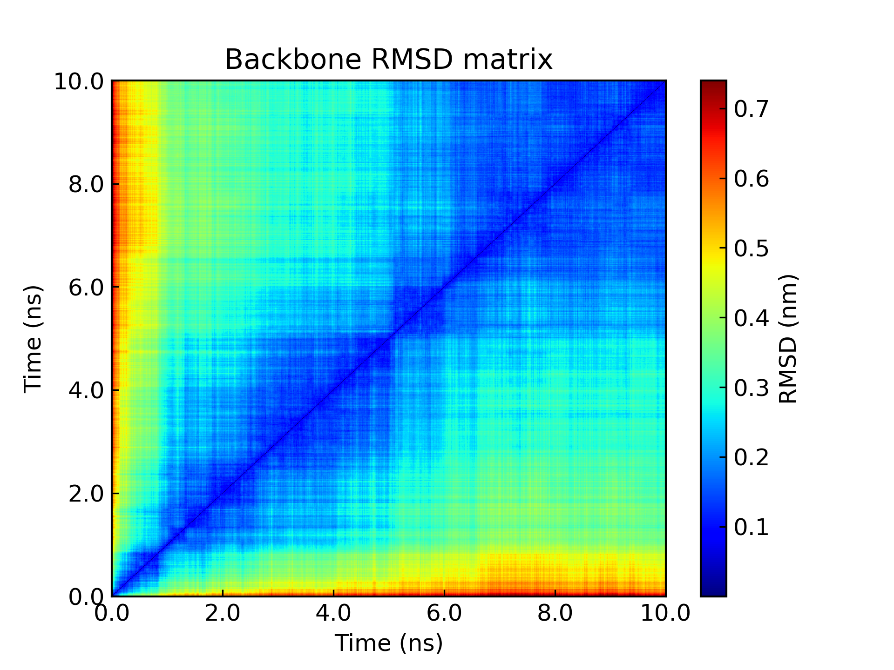
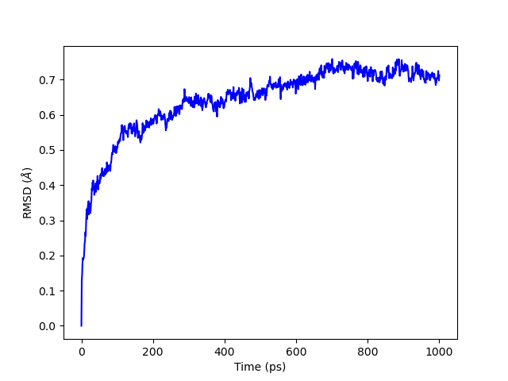

# RMSD

### 0. Intro

RMSD (Root Mean Square Deviation, 均方根偏差)，公式如下，其中δi就是第i个原子的位置偏移量。很好理解，表征的就是构象相对于参考结构的”位置偏移“。可以将RMSD的公式和RMSF的公式放一起学习，很有意思。
RMSD是模拟中非常基础又非常有用的概念。

 


### 1. RMSD的输出

在GMX中计算RMSD是非常简单的，可以直接使用`rms`命令来计算。总的来说，计算的过程分为两步：对齐（最小二乘）、RMSD的计算。

首先是把每一帧的结构与参考结构进行对齐，对齐的算法是最小二乘法。这一步相当于消除了体系整体运动的影响。之后是对对齐之后每一帧的结构，计算其与参考结构之间的RMSD。

使用GMX计算RMSD的最基础的操作如下：

```bash
gmx rms -s md.tpr -f md.xtc -o rmsd.xvg
```

在这里，`-s`参数之后的tpr文件就是我们设定的参考结构了。当然你也可以指定其他的结构文件作为参考结构。

运行命令之后程序会交互式的让你选择进行最小二乘对齐的对象，以及计算RMSD的对象。

根据你的需要来选择需要进行对齐的对象和计算RMSD的对象，比如说你需要计算蛋白质的RMSD，那一般可以选择Protein，或者backbone等蛋白质相关的组进行对齐和RMSD的计算；选择backbone的话，可以一定程度上减少柔性R基团对RMSD数据带来的“噪音”。

有的时候，默认的分组里面没有自己想要的组，也可以通过索引文件自行定义一下分组，然后用`-n`参数形式告诉`rms`命令，例如`-n index.ndx`。

简单可视化一下这里的rmsd.xvg看看：

 

有的时候，RMSD数据可视化出来，会有突降或者陡升（类似于平行于Y轴的剧烈变化）；这种情况通常是周期性导致的，也即可能部分分子出现了跨盒子的现象，校正一下周期性应该就行了。


### 2. RMSD的含义

常见的蛋白质相关的模拟文章中，RMSD通常被广泛用来表征两件事情：一个是模拟体系是否达到了平衡，一个是相关分子的稳定性。

体系的平衡，有些时候被简化地用RMSD曲线的平衡来进行表征，RMSD跑平了，体系就平衡了。当然，不同的体系判断平衡的方式和表征手段有着很大的不同，同样的体系判断平衡的方法和表征手段也可能多种多样。对于蛋白质来说，除了RMSD，Gyrate等多种表征也是可以用来判断体系平衡的。可以学习一下Sob老师的这篇长文：http://sobereva.com/627

当然，经常也能看到用RMSD来表征稳定性的；譬如说蛋白质的稳定性、蛋白配体结合的稳定性等。从RMSD的公式出发可以发现，RMSD本身是不包含稳定性相关的东西的，用RMSD表征稳定性，需要考虑“对照”的问题。如果只有单独的一条RMSD曲线，能说这个蛋白稳定不稳定吗？应该不能，虽然或许可以说这个蛋白跑平衡了。比方说，我有几个配体与同样的蛋白质（同样的初始结构）模拟的RMSD，那或许可以通过比较平衡时期不同蛋白质的RMSD，来判断蛋白质的稳定性，RMSD越高，说明蛋白质的构象与（同样的）参考结构差距越大，进而或许可以说明蛋白质的稳定性变差了。文章中常见这样的说法，但是究其根源，还是回到公式上去理解会比较好。

表征蛋白质的稳定性，可以对蛋白质（或者骨架）进行对齐和RMSD的计算；表征蛋白配体结合的稳定性，可以对蛋白质（或者骨架）进行对齐，然后对配体进行RMSD的计算，这相当于对齐了口袋，然后基于初始的口袋里配体的构象算了RMSD。

除了RMSD，或许还应该考虑以其他的表征手段来佐证稳定性的结果，比如FEL或者RMSF等。


### 3. RMSD矩阵

`rms`命令还有挺多功能，比如说绘制RMSD矩阵。有的时候蛋白质在模拟过程中会经历构象转变，进而会出现不同的构象集合（簇），RMSD矩阵是一个可靠的识别构象簇的手段。同一构象簇内不同结构之间的RMSD值较低，而不同构象簇内的结构之间RMSD值较大。

计算RMSD矩阵的时候，程序会计算轨迹1的所有帧的构象与轨迹2的所有帧的构象的RMSD，进而产生RMSD矩阵。

比方说我要计算同一条轨迹中构象的RMSD矩阵：

```bash
gmx rms -s md.tpr -f md.xtc -f2 md.xtc -o rmsd.xvg -m rmsd.xpm -n index.ndx
```

把RMSD.xpm可视化出来就是RMSD矩阵了，可以看到图上有些明暗不同的区域，这就是构象簇了。

 

要准确地考察成簇的情况，或许还需要结合`cluster`命令来进行一些分析。

```bash
gmx cluster -s md.tpr -f propep_fit.xtc -dm rmsd.xpm -dist rmsd-distribution.xvg -o clusters.xpm -sz cluster-sizes.xvg -tr cluster-transitions.xpm -ntr cluster-transitions.xvg -clid cluster-id-over-time.xvg -cl clusters.pdb -cutoff 0.2 -method gromos
```

`cluster`的结果显示这条轨迹里的蛋白有7个构象簇（在上述命令的条件下），两三个显著的构象簇，还有几个不那么显著的。

通过组合两条轨迹，然后计算RMSD矩阵，还可以考察两条轨迹是否对同一构象区域进行了采样等等，很有意思。


## 4. 其他工具绘制RMSD

#### 4.1 bio3d

Bio3D官方有tutorial，也有文档，挺好使的。用bio3d来绘制轨迹中分子的RMSD的话，需要先将轨迹转成dcd格式（可以用vmd或者mdconvert），还需要提前准备一帧并转为pdb格式。

```R
library("bio3d")

# read trajectory and structure files
dcd <- read.dcd("md.dcd")
pdb <- read.pdb("md.pdb")

# select atoms
backbone.inds <- atom.select(pdb, elety="backbone") 

# superposition
xyz <- fit.xyz(fixed=pdb$xyz, mobile=dcd,
               fixed.inds=backbone.inds$xyz,
               mobile.inds=backbone.inds$xyz)
dim(xyz) == dim(dcd)

# calculate the RMSD of backbone
rd <- rmsd(xyz[1,backbone.inds$xyz], xyz[,backbone.inds$xyz])
plot(rd, typ="l", ylab="RMSD", xlab="Frame No.")

# show the distribution of RMSD
hist(rd, breaks=40, freq=FALSE, main="RMSD Histogram", xlab="RMSD")
lines(density(rd), col="gray", lwd=3)

```

有兴趣的话建议去看bio3d的文档。我不太能保证上面代码的可行性，一大堆点点和奇怪的符号让我犯困。


#### 4.2 mdtraj

mdtraj是python的一个用来分析模拟轨迹的包，其中当然也包含着分析RMSD的功能。

mdtraj能读取xtc格式的轨迹，拓扑的话，可以自己生成一个pdb文件。

```python
import mdtraj as md
import matplotlib.pyplot as plt
import numpy as np

# load trajectory
traj = md.load("md.xtc", top="md.pdb")

# select atoms
protein_select = traj.topology.select("protein") # not Protein
protein_traj = traj.atom_slice(protein_select)

# calculate RMSD
rmsd = md.rmsd(protein_traj, protein_traj, 0)

# visualize RMSD
plt.plot(rmsd, color="blue")
plt.xlabel("Time (ps)")
plt.ylabel("RMSD ($\AA$)")
plt.show()

```

 


#### 4.3 mdanalysis

mdanalysis, 另一个有名的模拟分析包, 相较于MDtraj可能上手难度还低一些，文档资料都挺丰富翔实。

```python
import MDAnalysis as mda
import matplotlib.pyplot as plt

# load trajectory
traj = mda.Universe("md.pdb", "md.xtc")

# calculate RMSD of backbone
backbone_rmsd = mda.analysis.rms.RMSD(traj, traj, select="backbone“）

# transpose data makes it easier to plot
rmsd_T = backbone_rmsd.rmsd.T
print(rmsd.shape)

# plot rmsd
time = rmsd_T[1]
rmsd = rmsd_T[2]
plt.plot(time, rmsd)
plt.xlabel("Time (ps)")
plt.ylabel("RMSD ($\AA$)")
plt.show()
```

 


## Others

让我来测试一下这个显示IP属地的功能哈哈哈


