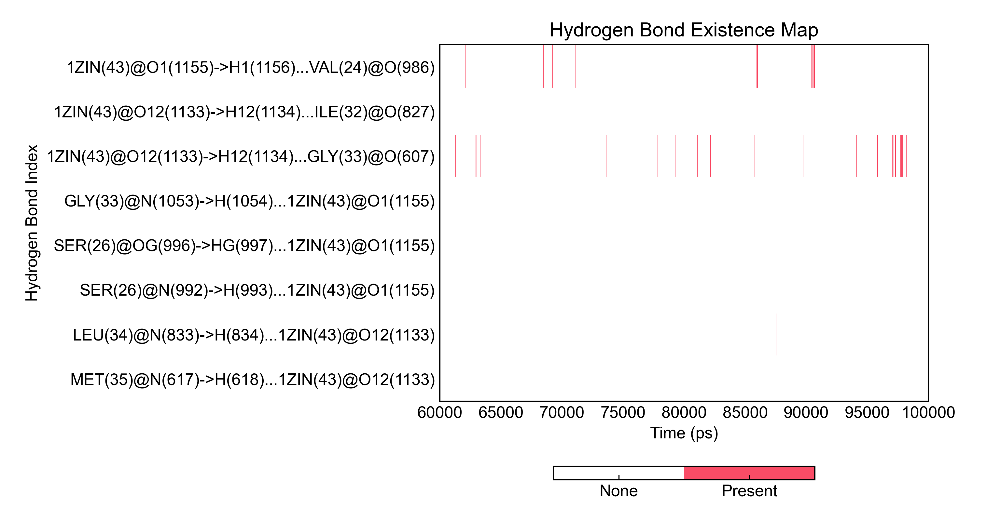
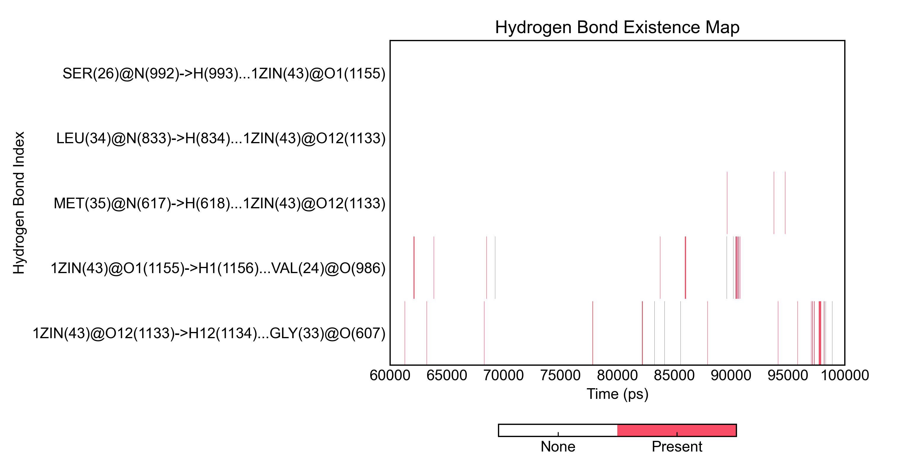
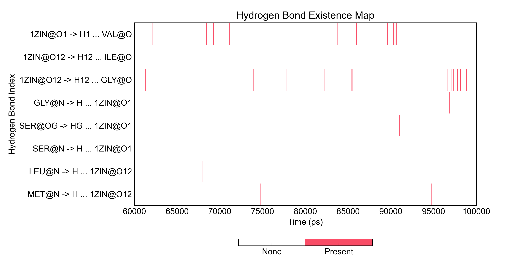

## DIT更新：一点儿新的功能

### Preface

自3月10号开源DuIvyTools以来，许多朋友捧场试用，我也收到了不少反馈，并断断续续在对DIT进行改进。非常感谢诸多朋友的支持和鼓励。


### Improvement

#### 关于功能

除了一些问题的修复，最重要的或许是一些零散的功能也被添加到DIT中来，主要是之前写的一些零碎的功能。用户可以通过"dit help"查看新增的功能选项，通过"dit <command> -h"可以看到具体的参数和使用简介。

其中或许值得一说的是处理gmx氢键结果的命令`hbond`。GROMACS的`hbond`命令会产生索引文件hbond.ndx、氢键数量文件hbnum.xvg、氢键占有率图hbmap.xpm等文件。之前的DIT可以分开对hbnum.xvg和hbmap.xpm文件进行可视化，结果稍显单薄。围绕氢键可以做的分析很多，至少利用现有的文件，我可以计算氢键占有率，得到形成氢键的原子名称等等。因而，DIT的`hbond`命令就是想要整合这些信息，给出进一步的结果。

`hbond`命令至少需要三个输入参数：一个包含形成氢键的所有成分的gro文件（可以直接用模拟结束后体系的gro文件）用于提取原子名称等信息、一个hbond.ndx索引文件和一个hbmap.xpm文件。`hbond`命令会给出占有率图、占有率表，可以根据需要从诸多氢键中选择你要想绘制的氢键进行绘图，可以自定义氢键名称（我很喜欢这个功能！）

举个例子：

```bash
dit hbond -f md.gro -n hbond.ndx -m hbmap.xpm
```


则可以得到图和表如下：



```bash
------------------------------------------------------------------------------- 
id donor->hydrogen...acceptor                                   occupancy(%)
------------------------------------------------------------------------------- 
0  MET(35)@N(617)->H(618)...1ZIN(43)@O12(1133)                  0.12
1  LEU(34)@N(833)->H(834)...1ZIN(43)@O12(1133)                  0.12
2  SER(26)@N(992)->H(993)...1ZIN(43)@O1(1155)                   0.07
3  SER(26)@OG(996)->HG(997)...1ZIN(43)@O1(1155)                 0.02
4  GLY(33)@N(1053)->H(1054)...1ZIN(43)@O1(1155)                 0.02
5  1ZIN(43)@O12(1133)->H12(1134)...GLY(33)@O(607)               2.12
6  1ZIN(43)@O12(1133)->H12(1134)...ILE(32)@O(827)               0.02
7  1ZIN(43)@O1(1155)->H1(1156)...VAL(24)@O(986)                 1.25
-------------------------------------------------------------------------------
```

表格可以通过`-csv`参数保存到csv文件中。

假如我要选择Id为0到3，以及5和7的氢键进行绘图：

```bash
dit hbond -f md.gro -n hbond.ndx -m hbmap.xpm -c 5 7 0-3
```

则可以得到图：



相应的表格：

```bash
------------------------------------------------------------------------------- 
id donor->hydrogen...acceptor                                   occupancy(%)
------------------------------------------------------------------------------- 
5  1ZIN(43)@O12(1133)->H12(1134)...GLY(33)@O(607)               2.12
7  1ZIN(43)@O1(1155)->H1(1156)...VAL(24)@O(986)                 1.25
0  MET(35)@N(617)->H(618)...1ZIN(43)@O12(1133)                  0.12
1  LEU(34)@N(833)->H(834)...1ZIN(43)@O12(1133)                  0.12
2  SER(26)@N(992)->H(993)...1ZIN(43)@O1(1155)                   0.07
-------------------------------------------------------------------------------
```


不同的场合可能需要不同格式的氢键名称，因而这里的氢键名称是可以通过`-hnf`参数自定义的。

默认的氢键名称格式是：`d_resname(d_resnum)@d_atomname(d_atomnum)->h_atomname(h_atomnum)...a_resname(a_resnum)@a_atomname(a_atomnum)`，d、a、h这三个符号分别表示供体、受体和氢原子，resname残基名，resnum残基序号，atomname原子名，atomnum原子序号。用户可以通过这几个字段加上任意的符号去定义自己喜欢的氢键名称，程序会检索你通过`-hnf`给出的模板，将相应的这些字段替换为对应的数据，剩下的字符都会保留。

如果你提供的氢键名称模板里有空格，记得在模板两端添加引号！

例如：

```bash
dit hbond -f hbond_test.gro -n hbond.ndx -m hbond.xpm -hnf "d_resname@d_atomname -> h_atomname ... a_resname@a_atomname"
```

则会生成：



表格也同时会被更改：

```bash
------------------------------------------------------------------------------- 
id donor->hydrogen...acceptor                                   occupancy(%)
------------------------------------------------------------------------------- 
0  MET@N -> H ... 1ZIN@O12                                      0.12
1  LEU@N -> H ... 1ZIN@O12                                      0.12
2  SER@N -> H ... 1ZIN@O1                                       0.07
3  SER@OG -> HG ... 1ZIN@O1                                     0.02
4  GLY@N -> H ... 1ZIN@O1                                       0.02
5  1ZIN@O12 -> H12 ... GLY@O                                    2.12
6  1ZIN@O12 -> H12 ... ILE@O                                    0.02
7  1ZIN@O1 -> H1 ... VAL@O                                      1.25
-------------------------------------------------------------------------------
```

用户不必在模板中包含所有的字段，大可以只保留你喜欢的。要是对于模板有更多需求，也可以戳我哦。

氢键这一块儿的东西本可以做得更复杂，比如计算每一个氢键的距离、角度等信息；但这就涉及到调用GROMACS，不同的用户必然有着大不同的环境，调用用户的软件会有很多的问题；其次也会掩蔽一些用户本该知道的细节。如果大家真有这块儿的需要，也尽可以戳我来实现它。


#### 关于样式

有几回有朋友问到DIT出的图能不能更改样式。当然是可以的，许久之前我增加了一个小功能，特别简单，可以根据当前工作路径下的mplstyle文件来调整出图的样式。mplstyle文件，或许有朋友熟悉，一个文本文件，里面定义了matplotlib绘图的一些格式。在DIT的github仓库的styles文件夹下，我也提供了两个示例模板。例如science.mplstyle:

```bash
# Matplotlib style for scientific plotting
# This is the base style for "SciencePlots"
# see: https://github.com/garrettj403/SciencePlots

# Set color cycle: blue, green, yellow, red, violet, gray
axes.prop_cycle : cycler('color', ['0C5DA5', '00B945', 'FF9500', 'FF2C00', '845B97', '474747', '9e9e9e'])

# Set default figure size
figure.figsize : 3.5, 2.625

# Set x axis
xtick.direction : in
xtick.major.size : 3
xtick.major.width : 0.5
xtick.minor.size : 1.5
xtick.minor.width : 0.5
xtick.minor.visible : True
xtick.top : True

# Set y axis
ytick.direction : in
ytick.major.size : 3
ytick.major.width : 0.5
ytick.minor.size : 1.5
ytick.minor.width : 0.5
ytick.minor.visible : True
ytick.right : True

# Set line widths
axes.linewidth : 0.5
grid.linewidth : 0.5
lines.linewidth : 1.

# Remove legend frame
legend.frameon : False

# Always save as 'tight'
savefig.bbox : tight
savefig.pad_inches : 0.05

# Use serif fonts
font.serif : Times New Roman
font.family : serif
mathtext.fontset : dejavuserif

# Use LaTeX for math formatting
text.latex.preamble : \usepackage{amsmath}
```

大家可以上网找一个这样的文件，或者自己写一个，然后放进当前的工作文件夹里，DIT会自动读入和调整绘图的。如果不知道这些参数该怎么写，可以参考matplotlib的style介绍或者rcParams参数(https://matplotlib.org/stable/api/matplotlib_configuration_api.html#matplotlib.rcParams)。


### Others

许久许久没有写新东西了，有着诸多的原因。

最开始是做筛选去了，用别人的模型，套套自己的数据，居然似乎也看到一点儿希望。

然后做了实验，折折腾腾，尚未结束，颇为心烦。

打了一份工，本来闲散的时间也被写代码占据了。很多好的想法和实现也都拿去换了钱买大米饭，而不能开源给大家一起开心开心。写文的时间写代码去了，没学到新东西因而也没有新内容，颇为抱歉。

打工倒也算是一种历练，在写代码的环境里才发现自学的编程能力实在不堪，工程能力也颇为平平，还需要继续努力才是。开始学更多的东西，看一些理论的书，重新出发算是。现在回头看3月写的DIT，程序设计的很多东西已经很需要改进了。

实践出真知。自己敲进去的才叫代码，看过的复制的其实不算。

与诸君共勉，一起加油！