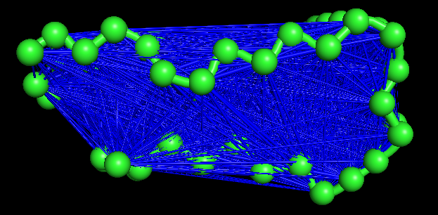

# 动态互相关矩阵DCCM之二三事

## 0. Preface

对于关键残基的识别、配体结合、突变效应和长距离相互作用等过程，从大分子动力学轨迹中提取的动态互相关性信息是非常重要的。

下图即是一张Bio3D绘制的某蛋白的动态互相关矩阵（DCCM）图。


做蛋白质相关的模拟，难免经常遇到有需要分析DCCM的场合，这篇小文就简单介绍DCCM相关的一点儿内容，包括数学过程以及目前能够计算DCCM的几种工具。


## 1. 一些儿数学过程

我们都很清楚方差的概念：

$$ \sigma (x, x) = < (x - \bar x)^2 >$$

也即我们有一个变量$x$，其可以取很多值。$x$的方差就定义为每一个取值与平均值的差的平方，最后再求平均（尖括号表示平均）。

协方差的概念也是类似的，比如我们有两个变量$x$和$y$：

$$c(x, y) = < (x - \bar x)·(y - \bar y)>$$

方差衡量的是变量的离散程度，协方差衡量的是两个变量的联合变化程度；也即如果两个向量表现出相似的行为，则协方差为正。

协方差虽然能够表征两个变量的联合变化，但是其绝对数值（变量的变化幅度）会影响我们对于相关性的观察。因而还有相关性系数的计算：

$$C(x, y) = \frac{c(x, y)}{(\sigma_x \sigma_y)^{1/2}} $$

相关性系数即是剔除了两个变量变化幅度的影响，标准化处理之后的协方差。其反映的就是纯粹的两个变量的相关性了。


动态互相关矩阵（dynamical cross-correlation matrix, DCCM）涉及到的数学过程尚属简易的，基本就是上面这些了。

我们想要获知成对残基之间的运动模式关联，可以计算成对残基之间的协方差。

公式如下：

$$c(i,j) = <\Delta R_{i} · \Delta R_{j} > $$

其中: $$\Delta R_{i} = R_{i} - < R_{i} >$$

$i$和$j$表示的是蛋白质氨基酸残基的序号，也即这里的$c(i, j)$是残基$i$和残基$j$的协方差。尖括号表示的是系综平均，也即计算的是一系列模型的平均，包括模拟轨迹里面的多帧构象、NMR得到的多个结构等等。$\Delta R_{i}$表示的是位置偏移量，且是基于系综平均位置的偏移量。

所谓的动态互相关矩阵，也就是把残基对之间的协方差转换为互相关指数，并按残基编号组织起来，成为一个矩阵而已。

$$C(i, j) = \frac{c(i, j)}{[c(i, i)·c(j, j)]^{1/2}}$$

当然，就像我们在PCA之前要进行平动和转动的去除一样，在计算DCCM之前也需要对齐结构，避免体系整体的运动掩蔽掉体系内部的运动。


最后，再简单阐述下对一段儿常规模拟轨迹计算DCCM的过程吧。

例如我们的蛋白质有N个残基，要计算残基alpha-C原子的DCCM。我们首先要做的是对这段儿轨迹进行周期性校正，去除平动转动。之后需要将每一帧的原子坐标**对齐**到参考结构，得到对齐之后的每一帧的原子坐标。然后对于每一个C原子，计算其在这段轨迹中的平均位置。有了这个平均坐标，就可以计算每一帧中这个C原子相对于其平均位置的偏移向量(x, y, z)了。之后对于每一帧轨迹，计算两两C原子偏移量之间的点积，也即协方差，然后再将多帧的协方差对帧数取平均。如此我们就得到两两残基之间在这段模拟轨迹中的协方差矩阵了。最后，对协方差矩阵上的元素计算相关性系数就可以得到动态互相关矩阵。


## 2. 于浩然老师的教程

关于如何利用Bio3D计算DCCM，不仅Bio3D官方教程可以作为参考，还可以参考于浩然老师20年发表的文章*A beginner’s guide to molecular dynamics simulations and the identification of cross-correlation networks for enzyme engineering*。这篇文章从一个具体的蛋白实例开始，阐述模拟构建、分析以及利用Bio3D绘制DCCM的过程。细节丰富详实，容易上手，并且文中有大量的关于DCCM含义、用途和意义的阐述，很值得一看。当然也可以辅以于老师18年的PNAS文章*Coupled molecular dynamics mediate long- and short-range epistasis between mutations that affect stability and aggregation kinetics*，在实际案例中体会DCCM的作用。


## 3. 利用gmx covar命令绘制DCCM

在于老师20年的文章中也提到，除了Bio3D，GROMACS本身的命令`covar`也可以计算得到协方差矩阵，但是还需要一点儿处理才能获得动态互相关矩阵。

`covar`命令用于计算并对角化（质量加权）的协方差矩阵，所有结构都会叠合到结构文件中的参考结构。计算得到的本征向量会写到轨迹文件中，这我们在之前的PCA与FEL绘制一文中已经遇到过。而计算得到的协方差矩阵会通过`-xpm`和`-xpma`写到xpm文件中。`-xpma`得到的xpm文件包含了每个原子对三个坐标的协方差的总和，因而是$N*N$的，N为原子数目。而`-xpm`得到的xpm则是包含每一维坐标的，因而是$3N*3N$的。要做后处理，当然或许可以直接读取xpm文件的数据然后计算互相关指数得到DCCM；也可以通过`covar`命令的`-ascii`参数输出整个的协方差矩阵到一个文本文件($3N*3N$)，如此得到的数据或许会稍微精准一些。之后就只需要读取这个文本文件的数据，处理一下就可以了。有幸，有现成的代码可以用！https://github.com/busrasavas/gmx_corr

首先我们需要利用`covar`命令得到协方差矩阵：

```bash
gmx covar -s md.tpr -f md_fit.xtc -o eigenvalues.xvg -v eigenvectors.trr -xpma results.xpm -ascii results.dat
```

按照需要选择对齐的组和计算的组，之后协方差矩阵会被保存到xpm文件中，协方差矩阵的数据信息会被保存到dat文件中。

得到的协方差矩阵可视化之后：


如前所言，协方差矩阵不仅包含了相关性信息，还有波动性信息在里面。其中左下到右上的对角线的点，表示的就是当前氨基酸的波动性信息，越红，波动性越强。

`covar`命令保存协方差矩阵数据到dat文件的方式有些奇怪，我以一个具体例子进行说明吧。

假设2个原子计算得到的协方差矩阵如下（6*6）：

```bash
 1  2  3  4  5  6 
 7  8  9 10 11 12
13 14 15 16 17 18
19 20 21 22 23 24
25 26 27 28 29 30 
31 32 33 34 35 36 
```

`-xpm`参数输出的矩阵就像这个样子，但是在输出到dat文件中的时候，每一行只保留了三个数字，顺序是从左到右、从上到下的输出这个矩阵，会得到：

```bash
 1  2  3
 4  5  6
 7  8  9
10 11 12 
13 14 15
16 17 18
19 20 21
22 23 24
25 26 27
28 29 30
31 32 33
34 35 36
```

只要知道dat文件里面数据的组织方式，就很好进行处理了。

$3N*3N$的矩阵如何处理成$N*N$的矩阵呢？很简单，对每一个$3*3$的矩阵求这9个数的总值就行了。

原理如此，执行计算的代码之后也会分享给大家。最后将矩阵可视化就可以得到最后的动态互相关图了。


#### 本征向量绘制豪猪图

这部分和DCCM关系不大，但是值得一提。我们可以利用`anaeig`命令从协方差矩阵中导出特征向量。这些特征向量可以用于绘制自由能形貌图，也可以通过绘制豪猪图去直观地观察轨迹沿主成分方向的投影。

比如说我们导出第一个主成分并写入到pdb文件中：

```bash
gmx anaeig -s md.tpr -f md.xtc -v eigenvectors.trr -eig eigenvalues.xvg -proj proj_ev.xvg -extr ev.pdb -rmsf rmsf_ev.xvg -first 1 -last 1
```

如此，我们就得到了轨迹沿主成分1方向的两个极值投影，也即一个包含两帧结构的蛋白质坐标文件（ev.pdb），以及主成分值随原子号（残基号）变化的rmsf_ev.xvg数据文件。

之后再把pdb文件加载到pymol中，用modevectors插件就可以观察到结构变化了：

```bash
modevectors ev11, ev11, 1, 2, factor=1, headrgb=(1,0,0),
tailrgb=(1,0,0), cutoff=0.5, outname=ev1
```


## 4. 其它DCCM绘制工具

除了著名的R语言包Bio3D，还有Python的一些库可以得到DCCM，如MD-TASK和Correlationplus。


### MD-TASK

 MD-TASK（https://md-task.readthedocs.io/en/latest/home.html）见刊于2017年，包含一系列python脚本，可以用于进行：

1. Residue Interaction Network (RIN) analysis
2. Perturbation Response Scanning (PRS)
3. Dynamic Cross-Correlation

使用MD-TASK计算DCCM是简单的，下载github上的仓库，安装所需的依赖MDTraj和R语言的igraph等就行。执行如下命令计算DCCM：

```bash
python calc_correlation.py --prefix mdtask_res --trajectory md.xtc --topology md.pdb
```

需要给脚本提供一个轨迹文件和一个拓扑文件（可以用pdb文件），程序默认选择alpha-C进行DCCM的计算。

我用一个130个原子8002帧的体系进行了测试，需要14分钟才能计算完成，稍微有点儿慢。

程序会输出DCCM每一个点的数据到txt文件（$N*N$），也会直接生成一张DCCM图，如下：


### Correlationplus

Correlationplus（https://github.com/tekpinar/correlationplus）见刊于2021年，也是一系列python脚本的集合，可以用于多种分析：

1. **normalized dynamical cross-correlations** with **Gaussian** network model
2. **normalized dynamical cross-correlations** with **Anisotropic** network model
3. **normalized dynamical cross-correlations** from a molecular dynamics trajectory
4. **normalized linear mutual informations** with **Anisotropic** network model
5. **normalized linear mutual informations** from a molecular dynamics trajectory
6. **normalized Pearson cross-correlations of backbone omega dihedral angles** from a molecular dynamics trajectory
7. **normalized Pearson cross-correlations of backbone phi dihedral angles** from a molecular dynamics trajectory
8. **normalized Pearson cross-correlations of backbone psi dihedral angles** from a molecular dynamics trajectory

Correlationplus被按功能分成多个模块，包括calculate、visualize、analyze等，每个模块又可用于多种分析和计算。下面简单阐述利用correlationplus计算DCCM的过程。


#### Calculate模块

执行命令如下：

```bash
correlationplus calculate -p md.pdb -f md.xtc -o corr_res.dat
```

得到的corr_res.dat就是最后的DCCM了（$N*N$）。 correlationplus的计算非常快，同样的体系，几秒钟。


#### Visualize模块

执行命令：

```bash
correlationplus visualize -i corr_res.dat -p md.pdb 
```

执行结束之后会得到五个文件：

1. 动态互相关矩阵图
2. 互相关系数与残基距离的散点图
3. 互相关系数与残基距离散点的数据文件
4. 用于显示残基互相关的pymol脚本
5. 用于显示残基互相关的vmd脚本（tcl）


先看动态互相关矩阵图：


（我的蛋白质是个五聚体，Correlationplus没有对残基序号进行重编，因而如图。）

再看互相关指数与残基距离的散点图：


距离越远，相关性越小。

最后展示下通过pymol脚本显示出来的残基互相关结构图：



我这里绘制了所有的互相关指数，因而难看，可以通过`-v`和`-x`参数指定要绘制的互相关指数的范围，如绘制0.8到0.9的互相关指数：

```bash
correlationplus visualize -i corr_res.dat -p md.pdb -v 0.8 -x 0.9
```


如此蓝线连接的就是互相关指数在0.8到0.9的残基了。

有一个值得小改进的地方，要是互相关的连接线能够按照互相关系数进行颜色的变化就更好了，目前线的粗细是和互相关系数关联的，但是辨识度确实不高。有空去PR哈哈哈。


#### diffMap命令

这个命令虽然官方文档没有着重讲，但也非常实用。我们经常需要比较不同情况下的DCCM图，比如说添加了配体的蛋白质DCCM图和无配体的蛋白质DCCM图。通过`diffMap`命令可以直接将两个互相关矩阵的数值对应相减，得到的就是DCCM的差异图。

比如说用结合了配体的蛋白质DCCM减去对照：

```bash
correlationplus diffMap -i pro_with_lig.dat -j control.dat -p md.pdb
```

得到图片：


图上红色就表示：相较于对照组，带有配体的蛋白质的这部分残基间的相互作用更加正相关了；蓝色则表示相互作用更加负相关了。因而，配体对蛋白质的残基互相关的影响一目了然就能看到。


#### Analyze模块

`analyze`命令可以利用前面得到的数据进行中心性分析（centrality analysis），可以用于确定活性位点、结合位点、关键突变位点或者异构残基等。The script can compute degree, closeness, betweenness, current flow closeness, current flow betweenness, eigenvector centralities and major communities. 具体内容就留待大家自己探索啦~


## 5. 代码复现

理解了数学过程，就可以尝试自己写代码复现DCCM的计算和绘制。正好天大顾涛大佬也在尝试复现Bio3D的DCCM绘制，就曾一同交流讨论。感谢顾涛大佬在交流过程中分享的宝贵建议和经验哈哈哈哈哈，对代码感兴趣的可以移步大佬的repo：https://github.com/Zuttergutao/GMXAnalysis/blob/main/DCCM.py

#### 点云fit

在计算协方差矩阵之前，很重要的一步就是对轨迹的每一帧结构进行对齐。不同的fit算法带来的结果是稍有差别的。

`covar`命令的最小二乘对齐：


点云fit算法：


所以在计算不同体系的DCCM时，为了方便比较，最好使用同一种工具或者方法绘制DCCM，以避免不同fit算法带来的误差。

在复现过程中，我们使用了kabsch算法，可以参考https://zhuanlan.zhihu.com/p/535105203。


#### 算法细节

总的计算流程是简单的。首先从轨迹文件中读取原子坐标，可以使用MDTraj或者libxtc等工具；然后使用对齐算法将每一帧的结构对齐到参考结构；之后计算所有帧的原子的平均位置，基于平均位置算出每一帧结构中每一个原子的位置偏移量；利用位置偏移量的两两点积算出每一帧的协方差矩阵，然后对时间求平均就得到最终的协方差矩阵了；最后对协方差矩阵的元素求相关性系数，就可以得到最终的动态互相关矩阵。


#### 绘图细节

如果是使用matplotlib绘图的话，很多函数都可以做，比如说`imshow()`、`matshow()`、`pcolormesh()`、`contourf()`、`contour()`等，稍微调一下就会挺不错的。

要实现类似Bio3D的DCCM图的效果的话，可以尝试如下的绘图代码：

```python
lis = ["#80FFFF","#A8FFFF","#D4FFFF","#FFFCFF", "#FFFCFF","#FFD4FF", "#FFA8FF", "#FF80FF"]
lis.reverse()
cm = matplotlib.colors.ListedColormap(lis)

im = plt.contourf(data, cmap=cm)
plt.contour(data, linewidths=0.2, levels=[-1.00, -0.75, -0.50, -0.25, 0.25, 0.50, 0.75, 1.00])
cb = plt.colorbar(im)
plt.xlabel("Residue No.")
plt.ylabel("Residue No.")
plt.title("Residue Cross Correlation")
plt.show()
```

`contourf()`形成等高线填充色块，然后用`contour`绘制一层等高线，效果如下：


和通过Bio3D绘制得到的图基本上一致：


## Others

诸位中秋节快乐！科研顺利！


