# 残基接触图 (Residue Contact Map)

## 0. Intro

蛋白质的动力学性质关键地决定了其生物学功能。但是描述蛋白质的动力学性质却是一件不容易的事情。泛泛而论的RMSD和RMSF等表征手段对于蛋白质相关性质的研究而言就像隔靴搔痒，鞭长莫及。

残基接触图，倒是可能给出了一种新的可能。残基接触图是两两残基之间距离的一个表征，这些距离被按照残基顺序组织成了一张二维矩阵图，我们可以根据需要设置距离截断，选择残基范围等等。目前，残基接触图已经被用于表征蛋白质复合物的形成、蛋白质折叠和解折叠、离子通道蛋白介导的离子过膜、抗原抗体结合界面研究等等。

残基接触图通过细致的2D距离表示来对蛋白质的结构信息进行编码。螺旋可以通过图上矩阵对角线的加厚来识别，平行和反平行的β折叠可以通过与矩阵对角线平行或正交的线条来表征。在这点上，残基接触图和动态互相关矩阵倒有些相似之处。

除了包含静态的信息之外，残基接触图还可以反映出蛋白质性质沿时间的变化。如果能更深入的分析，还可以加上残基间具体的相互作用类型、基于残疾接触矩阵的聚类和PCA等等。

很有意思，通常的分析是把体系中**原子的坐标**作为分析的基本，而在这里，**残基间距离**取而代之了。小小的一个思维转变可以带来很多的趣味。

本来是想借此文与诸位探讨一下残基接触图，调研深入，却发现自己难以把握，遂而以ConAn这个残基接触分析的工具为例，抛砖引玉，简要记述一下以残基距离为基本的分析方法。

## 1. gmx mdmat绘制残基接触图

GROMACS本身有一个命令`mdmat`可以计算残基接触图。例如：

```bash
gmx mdmat -s pro.tpr -f pro.xtc -mean dm.xpm -frames dmf.xpm -no num.xpm -nlevels 1501 -t 1.5 
```

`-mean`输出的是时间平均后的残基接触矩阵，`-frames`则是逐帧的残基接触矩阵，`-no`参数还会输出接触的数量等信息。`-nlevels`可以控制层级数量，比如说上面的命令就可以控制数据精度在0.001，默认的层级数量是40。`-t`的含义则是截断距离，默认是1.5 nm。

运行命令之后会要求选择计算的组，可以根据自己需要进行选择。`mdmat`命令默认计算的是残基对之间的最短距离，也即如果选择的是`Protein`组的话，计算得到的距离可能就是两个残基中距离最近的两个氢原子的距离；当然也可以选择`C-alpha`组，这样计算得到的距离就是残基alpha-C的距离。不同的组的选择在这里会表现为残基接触矩阵上线条的粗细不同。

在接触的定义上，不同的工具不太一样；也即原子组的选择、距离的计算方法、距离截断的数值都可能不太一样。

将dm.xpm可视化一下看看：

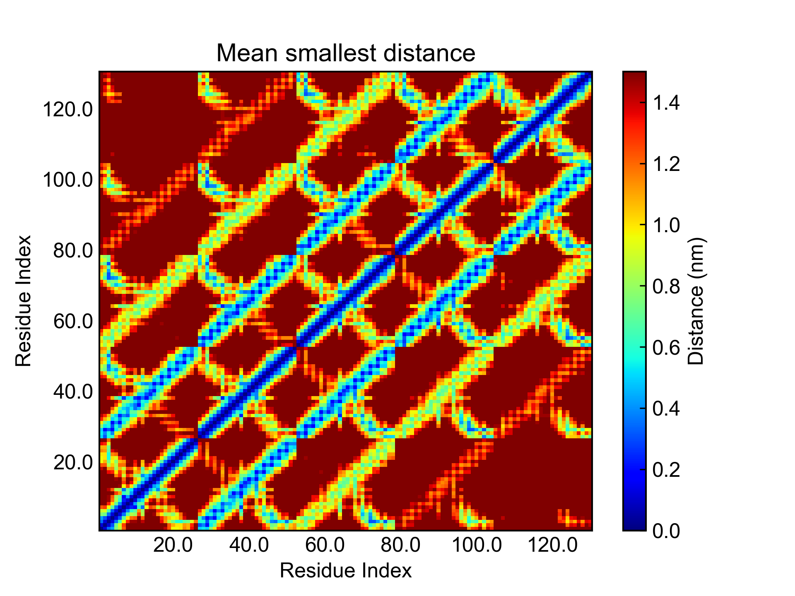

我的蛋白质是一个富含β折叠的五聚体(2beg)，这些信息都能很好地被残基接触矩阵表征出来。


## 2. ConAn

ConAn，18年发表在Biophys. J. 上的一个残基接触分析工具(https://github.com/HITS-MBM/conan)，就尝试用残基间距离取代原子坐标作为分析的基本，延展出了许多新的有意思的分析。

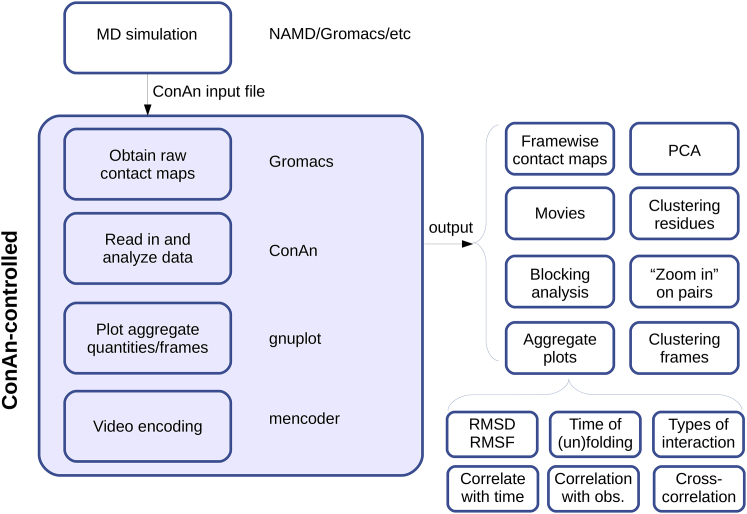

上图就是ConAn的基本框架了。可以看到，ConAn的正常使用需要依赖于Gromacs、Gnuplot以及MEncoder来进行残基接触图的数据获取(通过`mdmat`命令获得逐帧的残基接触图)、绘图以及动画的制作。ConAn依赖一个输入文件来控制所有的参数，这倒是也还算方便。比较有意思的是右边列出来的分析，除了接触图之外、还有基于残基距离的成簇分析、主成分分析、相互作用类型分析等等。

我们将在后文中逐步阐述每一种分析的原理，以及简要翻译作者写的ConAn相关的博文(http://contactmaps.blogspot.com/)。当然我没办法做到详尽，因而就挑一些个人觉得有意思的来探讨一下了。


### 2.1 残基接触矩阵

#### 逐帧残基接触矩阵

前文用`mdmat`命令的`-frames`参数得到的，就是**逐帧残基接触矩阵**，里面包含了每一帧的残基接触矩阵的信息。而`-mean`命令输出的矩阵，则是逐帧残基接触矩阵上的每一个元素在时间上平均之后的结果。也就是说，逐帧残基接触矩阵是$N \times N \times F$的，而平均残基接触矩阵是$N \times N$的，其中$N$是残基数目，$F$是帧数。

逐帧残基接触矩阵能够体现出体系的很多动态特性，可以观察到蛋白质折叠解折叠的过程、局部结构的变化、甚至是小分子相对于蛋白质的转移路径等等。如果做成动画的话，展示或者放进补充材料，也会挺有意思。


#### 总接触时间矩阵

总接触时间矩阵，就是对于每一个残基对，计算其在总分析时长中形成了接触的时间占比。含义上与后面的Encounter时间矩阵有点儿重复，可以用于表征接触的稳定性。

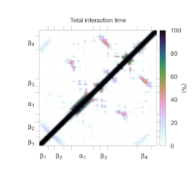


#### 局部接触时间

局部接触时间，其实就是将总接触时间矩阵上的非零数值，对于每一个氨基酸求平均；也即对于残基$i$，遍历累加残基$i$与所有残基的接触时间的总和，再除以残基$i$涉及的接触数目。局部接触时间可以侧面衡量区域的稳定性。局部接触时间更大的残基，其与周围氨基酸的构象相对更稳定。

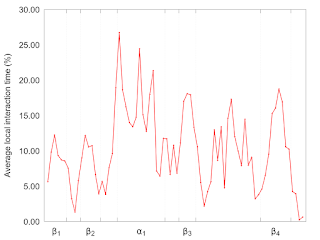


#### 帧间残基接触矩阵

帧间残基接触矩阵（名字译得怪，抱歉），实际上就是两张残基接触矩阵做差。可以相对于时间上的前一帧接触矩阵做差，也可以相对于初始残基接触矩阵做差。总之，相对于原始的残基接触矩阵，帧间残基接触矩阵更能突出**变化**本身。


#### 残基距离的标准偏差矩阵

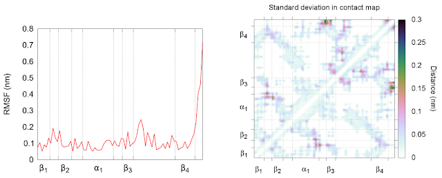

残基距离的标准偏差矩阵，就是对每个残基对的距离在时间上的变化求一个标准偏差，也即衡量的是残基距离的波动性。另一个我们常见的衡量波动性的指标是RMSF。RMSD被定义为残基的坐标在其平均位置周围的波动，这个过程中通常涉及到坐标的对齐。例如在GMX中就是使用最小二乘法将结构对齐的。如果蛋白质的结构在模拟过程中有较大的改变，例如解折叠等现象，那么得到的RMSF通常就不那么准确。而残基距离本身就是分子内的信息，不涉及整体的平动转动等情况，得到的波动性信息会更加可靠。

上图呈现的就是传统的RMSF折线图和残基距离的标准偏差矩阵，图上颜色越深的部分就是波动性最强的部分了。或许还可以按照局部接触时间的计算方法计算得到如左图一样的折线图，折线图或许更直观一些。


### 2.2 Pearson相关矩阵

### 残基距离与可观测变量的Pearson相关矩阵

**时间**：对于残基接触矩阵的每一个元素（实际上是残基$i$和残基$j$之间的距离随时间变化的一个数值序列），计算距离序列与时间序列的互相关指数，即可以得到残基距离与时间的相关矩阵。这样的一个矩阵可以用于表征一些酶底物口袋的开合、某些残基之间相互作用的形成和消失等等的动态过程。

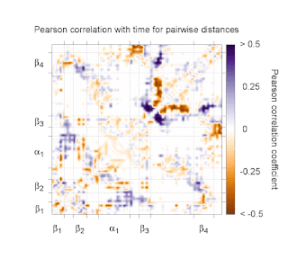

上图蓝色的区域就表示这些残基距离随着时间的增大而变大了，而橙色则更好相反，残基距离随着时间的流逝而减小了。

**回旋半径**和**距离**等变量也可以替代时间，也可以代替时间去和残基距离做互相关矩阵，当然表征的就是不同的东西了。例如距离，可以考察蛋白质整体的结构变化与某一个特定距离变化之间的关系。


#### 残基距离间的互相关矩阵

残基距离间的互相关矩阵其实和DCCM类似，只是残基距离间的互相关是一个4维的对象，需要一些手段来“投影“到2维。

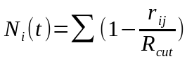

$r_{ij}$是残基$i$和$j$之间的距离，$R_{cut}$则是截断距离，gmx中默认是1.5纳米；求和是对$j$而言的，也即实际上就是把某一时间帧$t$的2维残基接触矩阵转换成了1维的序列；如此也就和DCCM中的残基的位置偏移量是样式一致的了。

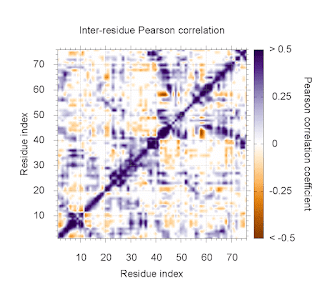

至于残基距离间的互相关矩阵的含义，其实与DCCM没有太大的差别。区别在于，DCCM的计算过程中涉及到结构对齐，而这里不涉及；对齐总是有误差的，还要考虑到结构变化较大的情况，因而这里的残基距离间互相关矩阵是有一些优势的。


### 2.3 Encounter

Encounter挺有意思的。gmx是默认将截断距离以内的都算作contact，encounter的定义和contact类似，但稍微复杂一点儿。如果两个残基间的距离小于低阈值，则认为开始形成encounter，如果形成了encounter的两个残基间的距离大于高阈值，则认为encounter消失。之所以要设置两个阈值而不是一个，可以避免按低估encounter的稳定性，也可以避免某些在阈值附近波动的残基间距离带来的多个短时间的encouter (https://doi.org/10.1073/pnas.0910390107)。

Encounter相较于contact来说更加精细，也更具有自由度。用户可以根据自己需要去设定阈值，比如要研究类似于氢键长度的相互作用，就可以将阈值设置到0.3纳米左右，要是宽泛一点儿，也可以到0.6纳米左右。Encounter可以玩的花样也不算少，多数都可以用来表征蛋白质结构的大的变化。


对于每一个残基距离，找出第一个encounter形成的**时刻**，并组织成矩阵的形式，就得到First Enounter Matrix。按照同样的方法，还可以得到：

- Last Encounter Matrix
- Average Encounter Matrix
- Encounter Number Matrix
- Encounter Time Occupancy Matrix


这样的矩阵可以用于表征蛋白质结构变化或动力学过程中的细节问题，比如哪些残基对最先分离、残基对的稳定性等等问题。


### 2.4 RMSD

#### RMSD

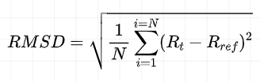

这是我们常见的RMSD的计算公式。同样的，我们用残基距离替代坐标，就可以算出基于残基距离的RMSD。一般可以基于第一帧，算后面帧数的RMSD。先对于每一个残基对，算出距离偏差，平方之后求平均再开方，就好了。可以得到一条跟普通RSMD曲线类似的曲线。区别在于，这里我们同样没有结构对齐的过程，利用的是分子内的指标，可能更加精准反映结构的变化。

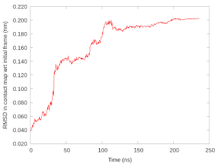


#### 帧间RMSD

普通的RMSD曲线是基于第一帧做的，而每两个时间帧之间算一个RMSD，就可以构成我们常见的RMSD矩阵。同样的，基于残基距离，也可以绘制出RMSD矩阵。

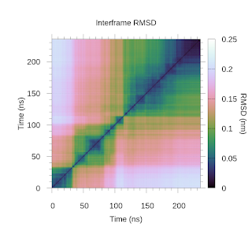

RMSD矩阵可以用于成簇分析。例如上图，可以大致看出可能有三个主要的簇。当然，具体的成簇分析还要通过一些算法或工具去做。ConAn可以利用RMSD矩阵做成簇分析，还可以计算簇内的生命周期等等。这些方法对于识别动力学过程中的关键构象或者重要变化都很有帮助。


### 2.5 相互作用类型

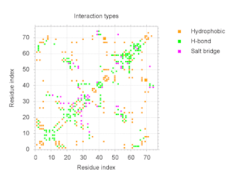

通过判断形成接触的两个残基的种类，还可以识别出具体的相互作用的类型，如上图，可以用于观察相互作用的形成和消失等情况。


## 3. Other Tools

残基距离的故事还有很多，除了ConAn之外，也还有很多相关的工具。


### 3.1 Contact_Map

1. https://github.com/dwhswenson/contact_map
2. https://contact-map.readthedocs.io/en/latest/index.html

ConAn因为是利用GROMACS的`mdmat`命令来得到残基接触图的信息，有着一些局限。Contact_Map是基于MDTraj的，所以在原子组的选择方面有更多的灵活性，可以基于分析的需要自由地定义进行残基接触分析的组分。除此之外，Contact_Map还能给出更多数据方面的信息，比如可以筛选出占有率最高的残基接触、找到某一残基涉及的所有接触、分析原子分辨率级别的接触等等。Contact_Map还有个有意思的功能，它能够用于观察接触的并发，能够分析出同时发生的contact，可以帮助发现一些稳定的状态等等。


### 3.2 MDcons

MDcons: Intermolecular contact maps as a tool to analyze the interface of protein complexes from molecular dynamics trajectories (https://www.ncbi.nlm.nih.gov/pmc/articles/PMC4095001/)。

MDcons主要的设计用途是用于分析两个蛋白质的接触界面信息的。同上面讲述的残基接触矩阵一样；这不过横纵坐标不是来自同一个蛋白质的残基了，而是横坐标是一个蛋白质的残基，纵坐标是另一个蛋白质的残基。基于此，我们同样可以进行上述的所有分析。还有比较有意思的是这篇文章中出现的几个无量纲数 C50、C70 以及 C90 ，表征的都是全局的接触稳定性。

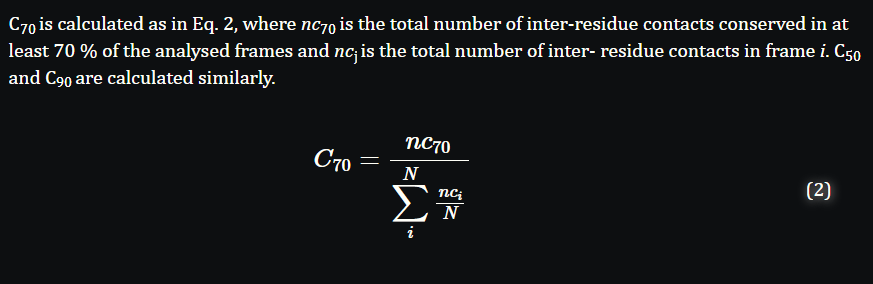


### 3.3 PyContact

PyContact (https://doi.org/10.1016/j.bpj.2017.12.003) 的使用难度要低很多，这是一个图形化的工具，同时还贴心的预留了编程的接口。这个工具提示我们不必把残基就限定为蛋白质的残基，还可以离子、膜等单元，如此可以得到更多的分析，可以用于研究离子穿膜路径等更广泛的用途。

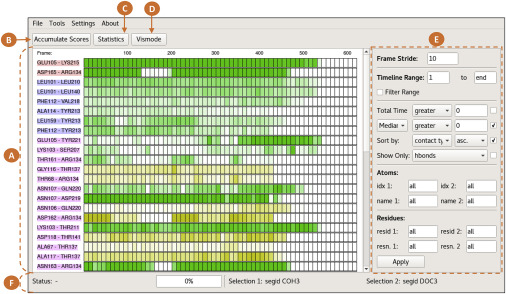

 

## Others

这篇笔记中所有的图片（除第一张）都来源于相关工具的文章或者博客，在此注明。

残基接触矩阵相关的分析似乎不太常见，但是在某些情况下还真是会比较有用。笔记中所谈论到的分析方法都不算是复杂的，之后要是有时间或许我可以将部分功能复现并集成到DIT中。看明白是一种快乐，能复现出来却是另一种不同的快乐。

最开始起意想写点儿关于残基接触矩阵的内容，是看完ConAn的文章后，感于它玩出来的花样。有时候会觉得，能为自己的体系挑选出合适的分析表征手段，真是不太容易。希望本文能为大家的分析方法list增添一个可选项。

在文末列一下蛋白质（配体）模拟相关的分析手段，欢迎大家评论区补充呀！

1. 均方根误差RMSD
2. 均方根波动RMSF
3. 回旋半径Gyrate
4. 溶剂可及化表面积SASA
5. 自由能形貌图FEL
6. 主成分分析PCA
7. 氢键分析
8. 盐桥分析
9. 距离分析
10. 蛋白质二级结构分析
11. 动态互相关矩阵DCCM
12. 残基接触图分析
13. 残基作用网络分析RIN


秋天到了，祝诸君顺利~
