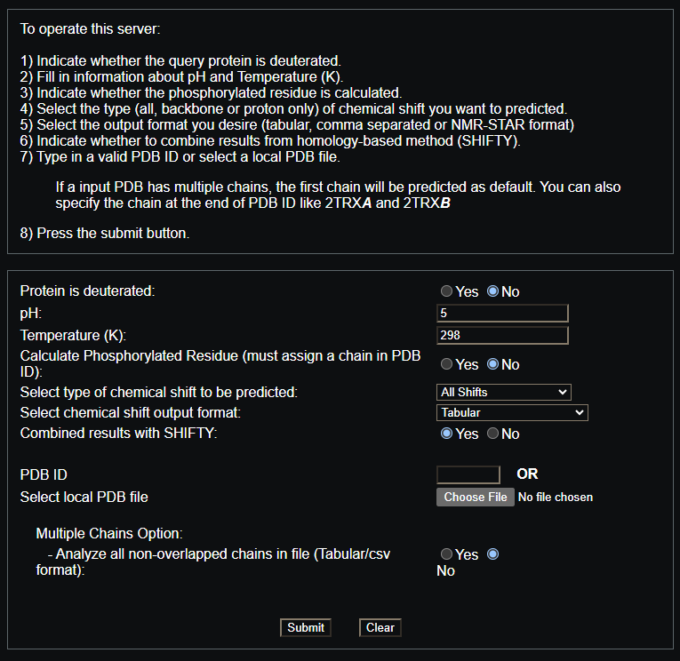
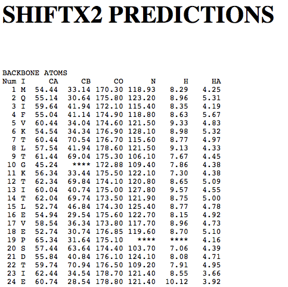
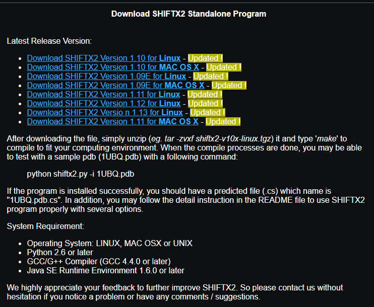

# 使用SHIFTX2计算模拟轨迹化学位移及其RMSD

## Intro

SHIFTX2可用于预测蛋白质骨架和侧链原子的化学位移，仅仅需要蛋白质各原子的坐标作为输入。其利用精选的蛋白质化学位移的实验数据进行了机器学习的训练，得到了非常可靠的预测效果，是目前通过坐标计算化学位移的一个主要的软件。（SHIFTX2的paper在此：10.1007/s10858-011-9478-4）

一些文章中，如ff03CMAP力场的文章（https://pubs.acs.org/doi/10.1021/acs.jctc.9b00623），就使用SHIFTX2计算模拟轨迹中各原子类型的化学位移，并计算其与实验结构的RMSD，以**表征模拟中蛋白质构象与实验解析出来的蛋白质构象之间的差异**。

很多模拟的场景中，也确有比较模拟构象与实验构象的需要。因而本文就暂且讨论与此相关的内容。


## SHIFTX2

SHIFTX2同时提供了webserver和可下载的本地执行程序，官网（http://www.shiftx2.ca/index.html）的文档虽然草草，但是也足以了解和使用了。

### webserver

webserver的界面如下，简单明白：



输入了这些信息提交之后，得到的应该是一个文本文件，里面记录了蛋白质的不同氨基酸不同原子类型的化学位移值，一目了然。




### 本地执行程序

SHIFTX2官网也能下载到他们打包好的本地可执行程序，包含Linux和MAC OS X的，可惜没有windows的。安装和使用方式官网也有一个简单的介绍。



需要简单的配置一下环境，安装一下Java SE Runtime什么的。


## RMSD计算

接下来我们探讨如何从SHIFTX2的预测值计算化学位移的RMSD。这里就不列出RMSD的公式了，但是意思是一样的：先找到一个参考，然后计算每一帧蛋白质构象的预测值与参考值的差，在利用RMSD的定义计算出该帧的RSMD即可。参考的选择可以直接用实验解出来的化学位移数据，如果没有的话，就只能退而求其次，基于实验解出来的结构使用SHIFTX2求预测值作为参考值了。

一下是一个SHIFTX2预测值结果的示例：

```txt
CHAIN,NUM,RES,ATOMNAME,SHIFT
A,17,L,C,175.5207
A,17,L,CA,54.1593
A,17,L,CB,43.0472
A,17,L,H,8.0492
A,17,L,HA,4.5695
A,17,L,N,123.4632
A,18,V,C,174.3074
A,18,V,CA,61.9443
A,18,V,CB,32.5983
A,18,V,H,8.4440
A,18,V,HA,4.3037
A,18,V,N,127.4951
A,19,F,C,172.8870
A,19,F,CA,55.7632
A,19,F,CB,43.0959
A,19,F,H,8.4162
A,19,F,HA,5.6658
A,19,F,N,126.4484
......
```

假设我们这里计算C、CA、CB、H、HA、N这几类原子的化学位移的RMSD，同时假设你已经拿到实验的化学位移数据，或者计算得到了蛋白质实验构象的化学位移数据。首先我们需要将模拟的蛋白质轨迹切分成一帧一帧的蛋白质pdb文件，并用SHIFTX2进行预测并得到化学位移的预测值：

```bash
shiftx2.py -i pro_0.pdb -u
shiftx2.py -i pro_1.pdb -u
shiftx2.py -i pro_2.pdb -u
shiftx2.py -i pro_3.pdb -u
shiftx2.py -i pro_4.pdb -u
......
```

如此我们得到了每一帧蛋白构象的预测值。

接下来尝试计算每一种原子类型每一帧的化学位移的RMSD，首先我们写一个函数获取预测文件中某一原子类型的数据：

```python
def get_data(ref_file):
    CA_list, CB_list, C_list, N_list, HA_list, H_list = [], [], [], [], [], []
    with open(ref_file, 'r') as fo:
        lines = fo.readlines()
    for line in lines[1:]:
        items = line.split(",")
        atomname = items[3]
        shift = float(items[4])
        if atomname == "CA":
            CA_list.append(shift)
        elif atomname == "CB":
            CB_list.append(shift)
        elif atomname == "C":
            C_list.append(shift)
        elif atomname == "N":
            N_list.append(shift)
        elif atomname == "HA":
            HA_list.append(shift)
        elif atomname == "H":
            HN_list.append(shift)
    return CA_list, CB_list, C_list, N_list, HA_list, H_list
```

因为蛋白质内有多个氨基酸，因而这里每个原子类型都有多个预测值，分别属于不同的氨基酸。后面计算RMSD的时候，需要同一氨基酸的原子数据对应相减。

如此我们就可以获得了某一帧的某一原子类型和参考的化学位移数据，接下来写一个小函数计算某一原子类型在某一帧时与参考结构的RMSD：

```python
def calc_RMSD(lis0, lis1):
    if len(lis0) != len(lis1):
        print("ERROR wrong in length of lis to calc RMSD")
        exit()
    displacement = []
    for i, j in zip(lis0, lis1):
        displacement.append((i-j)**2)
    rmsd = np.sqrt(np.average(displacement))
    return rmsd
```

这里就是计算两组预测值之间的一一对应的差的平方，再计算平均值和开方，得到的就是一个RMSD值了。

最后我们只需要依次读入每一帧的蛋白质的预测结果，计算相应原子类型的RMSD就可以了。

大致完整的伪代码示例如下：

```python
def calc_RMSD(lis0, lis1):
    if len(lis0) != len(lis1):
        print("ERROR wrong in length of lis to calc RMSD")
        exit()
    displacement = []
    for i, j in zip(lis0, lis1):
        displacement.append((i-j)**2)
    rmsd = np.sqrt(np.average(displacement))
    return rmsd

def get_data(file):
    CA_list, CB_list, C_list, N_list, HA_list, HN_list = [], [], [], [], [], []
    with open(ref_file, 'r') as fo:
        lines = fo.readlines()
    for line in lines[1:]:
        items = line.split(",")
        atomname = items[3]
        shift = float(items[4])
        if atomname == "CA":
            CA_list.append(shift)
        elif atomname == "CB":
            CB_list.append(shift)
        elif atomname == "C":
            C_list.append(shift)
        elif atomname == "N":
            N_list.append(shift)
        elif atomname == "HA":
            HA_list.append(shift)
        elif atomname == "H":
            HN_list.append(shift)
    return CA_list, CB_list, C_list, N_list, HA_list, HN_list

def deal_shift_data():
    ## get reference data
    ref = "the_data_of_reference.pdb"
    CA_ref, CB_ref, C_ref, N_ref, HA_ref, HN_ref = get_data(ref)
	## calc RMSD of each frame
    CA_rmsd, CB_rmsd, C_rmsd, N_rmsd, HA_rmsd, HN_rmsd = [], [], [], [], [], []
    ## chemical shift data file for each frame
    files = [f"pro_{i}.pdb.cs" for i in range(61)]
    for file in files:
        CA_list, CB_list, C_list, N_list, HA_list, HN_list = get_data(file)
        CA_rmsd.append(calc_RMSD(CA_ref, CA_list))
        CB_rmsd.append(calc_RMSD(CB_ref, CB_list))
        C_rmsd.append(calc_RMSD(C_ref, C_list))
        N_rmsd.append(calc_RMSD(N_ref, N_list))
        HA_rmsd.append(calc_RMSD(HA_ref, HA_list))
        HN_rmsd.append(calc_RMSD(HN_ref, HN_list))
```

最后这里的`CA_rmsd`等变量里面保存的，就是各原子类型的逐帧的化学位移的RMSD值了。


## Other

好久不见，科研顺利啊诸位~


