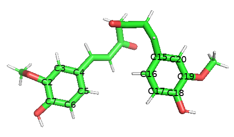
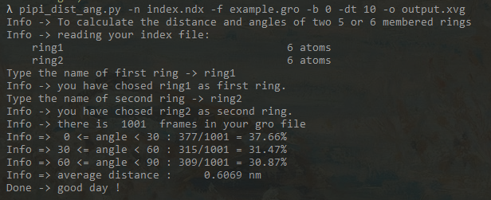
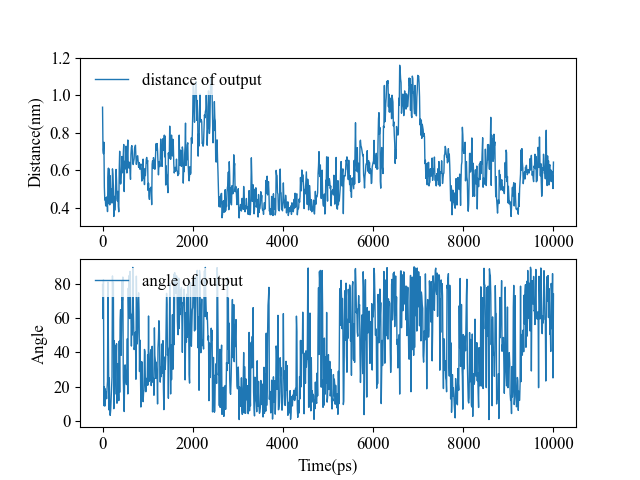

## a script to calculate the distance and angle of two plane 5 or 6 memberd rings

#### Important

This script can only be used to calculate distance and angles of **plane** rings. And the ring can only be consisted of 5, 6 or 7 atoms. Less or more is not supported. 

The normal of plane ring is calculated by three atom of the ring whose id are 0, 2, 4. So different order of atom index in your ndx file may lead to slightly different results. 


#### Usage  

```bash
$ python3 pipi_dist_ang.py -h
Info -> To calculate the distance and angles of two 5 or 6 membered rings
usage: pipi_dist_ang.py [-h] [-n N] [-f F] [-b B] [-dt DT] [-o O]

optional arguments:
  -h, --help  show this help message and exit
  -n N        index file which contains two groups of rings
  -f F        gro file
  -b B        set the start time, default=0
  -dt DT      set the time interval, default=1
  -o O        the results data, default output.xvg
```

```bash
$ python3 pipi_dist_ang.py -n index.ndx -f example.gro -b 0 -dt 10 -o output.xvg
```

Using the command upside, you can calculate the distance and angle between two rings in example.gro.

Due to some reasons, this script is unable to parse the time sequnence from gro file. So the **starting time** and **time interval** are needed to make the output time sequence correct. Otherwise, time is actually the number of frames instead of MD time. `-b 0 -dt 10` means this gro file is starting from 0 ps and each time step is 10 ps. 


#### example

**You need to add the atom index of two rings to your ndx file first. Then apply this script.**

In the example.gro, there are 1001 frames of MD trajectory of curcumin which contains two benzene rings. 

PyMol or other molecule visualization software are recommended to obtain the atom information of two rings.



Select the atoms of two rings you want to calculate, and label their atom name like the picture above. 

Add the corresponding atom index to your ndx file. You will find the atom index of C3 atom is 33, and the atom index of C19 is 6 in the example.gro file, and this atom belongs to ring1.  

Finally the ndx file should contain two groups of two rings, like below : 

```ndx
[ ring1 ]
35 33 32 46 44 41
[ ring2 ]
14 12 10 7 6 15 
```

After well prepared, run this script. It will read ndx file and make you input the group name of two rings you want to calculate. 



When it finished, an output.xvg will be generated in current directory. Excel, Origin or `xvg_compare.py`could be used to visualize the result data. And some information (eg. average distance) have been output to your screen. 

