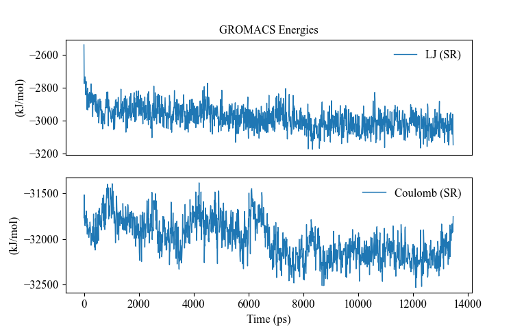

#### description

此脚本用于对GROMACS生成的xvg文件进行可视化，Windows上似乎没有简单的xvg文件可视化工具，于是笔者自己写了一个，标题、ylabel、xlabel等获取或许不够准确，主要用于呈现数据的变化趋势。

#### command

```shell
python3 xvgshow.py filename.xvg -s -n1,2,3
# arguements:
#     filename.xvg : generated by GROMACS
#     plotMode: '-s' for subplots or '-o' for oneplot (default '-o') (optional)
#     column number: start with '-n' and split number by ',', like '-n2,3,5' (optional)
```

