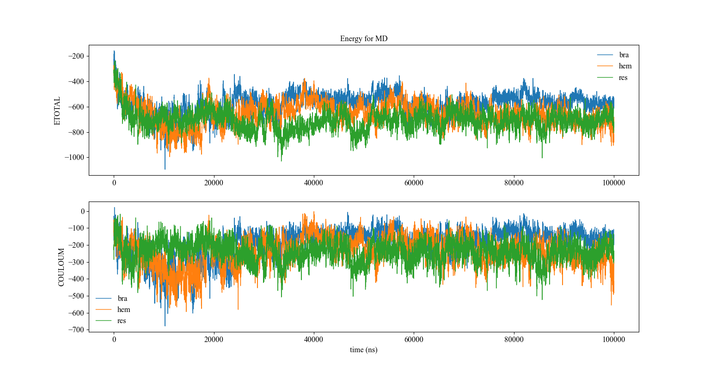

#### Description
此python3脚本用于对比几个**整理之后的xvg文件**，这类xvg文件第一行是column name，后面是数据，第一列是时间。此脚本可以读入多个这类xvg文件并按照输入的参数输出相应的数据列的折线对比图。

#### Command

```shell
python xvg_compare.py brazilin.xvg hematoxylin.xvg resveratrol.xvg -n56 -yETOTAL,COULOUM -lbra,hem,res -tEnergy_for_MD -xtime_(ns)
```



读入的参数包括多个xvg文件、选择输出作图的列数、图的多个ylabel（列数大于一将按照子图的形式作图）、图的xlabel、图title、图例。
xvg文件名没有前缀，其余的输入参数都添加相应的前缀即可；-y表示ylabel、-x表示xlabel、-t表示title、-l表示图例。参数中的"_"会被替换成空格在图上显示，区分一个参数的不同项使用","间隔，如-ylabel1,label2表示子图1的ylabel为label1，子图2的ylabel为label2。图例的参数与此一致。
本项目所有脚本都没有使用常规的命令行参数输入方式，因为一些遗留问题，笔者也懒得改了
